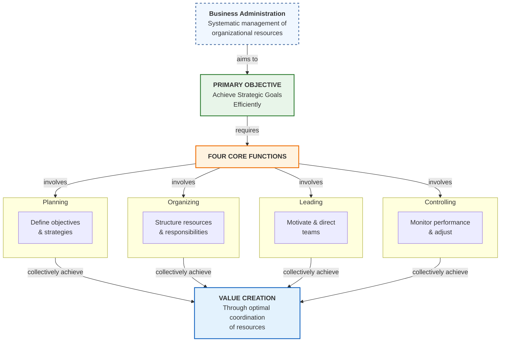

```mermaid
flowchart TD
    A[<b>Business Administration</b><br>Systematic management of<br>organizational resources]:::title
    B[<b>PRIMARY OBJECTIVE</b><br>Achieve Strategic Goals<br>Efficiently]:::objective
    C[<b>FOUR CORE FUNCTIONS</b>]:::functions
    
    subgraph D[Planning]
        D1[Define objectives<br>& strategies]
    end
    
    subgraph E[Organizing]
        E1[Structure resources<br>& responsibilities]
    end
    
    subgraph F[Leading]
        F1[Motivate & direct<br>teams]
    end
    
    subgraph G[Controlling]
        G1[Monitor performance<br>& adjust]
    end
    
    H[<b>VALUE CREATION</b><br>Through optimal coordination<br>of resources]:::value
    
    A -->|aims to| B
    B -->|requires| C
    C -->|involves| D
    C -->|involves| E
    C -->|involves| F
    C -->|involves| G
    D & E & F & G -->|collectively achieve| H
    
    classDef title fill:#f0f7ff,stroke:#4a6fa5,stroke-width:2px,color:#333,stroke-dasharray:5 5
    classDef objective fill:#e8f5e9,stroke:#2e7d32,stroke-width:2px,color:#333
    classDef functions fill:#fff3e0,stroke:#ef6c00,stroke-width:2px,color:#333
    classDef value fill:#e3f2fd,stroke:#1565c0,stroke-width:2px,color:#333
```
