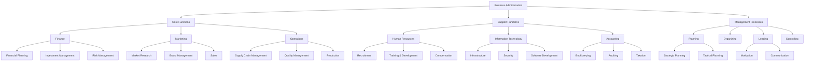

```mermaid
flowchart TD
    A[Business Administration] --> B[Core Functions]
    A --> C[Support Functions]
    A --> D[Management Processes]

    B --> FIN[Finance]
    B --> MKT[Marketing]
    B --> OPS[Operations]

    FIN --> FIN_PLAN[Financial Planning]
    FIN --> INV[Investment Management]
    FIN --> RISK[Risk Management]

    MKT --> MKT_RES[Market Research]
    MKT --> BRAND[Brand Management]
    MKT --> SALES[Sales]

    OPS --> SCM[Supply Chain Management]
    OPS --> QM[Quality Management]
    OPS --> PROD[Production]

    C --> HR[Human Resources]
    C --> IT[Information Technology]
    C --> ACC[Accounting]

    HR --> RECRUIT[Recruitment]
    HR --> TRAIN[Training & Development]
    HR --> COMP[Compensation]

    IT --> INFRA[Infrastructure]
    IT --> SEC[Security]
    IT --> SW_DEV[Software Development]

    ACC --> BOOK[Bookkeeping]
    ACC --> AUDIT[Auditing]
    ACC --> TAX[Taxation]

    D --> PLAN[Planning]
    D --> ORG[Organizing]
    D --> LEAD[Leading]
    D --> CTRL[Controlling]

    PLAN --> STRAT[Strategic Planning]
    PLAN --> TACT[Tactical Planning]

    LEAD --> MOTIV[Motivation]
    LEAD --> COMM[Communication]
```
