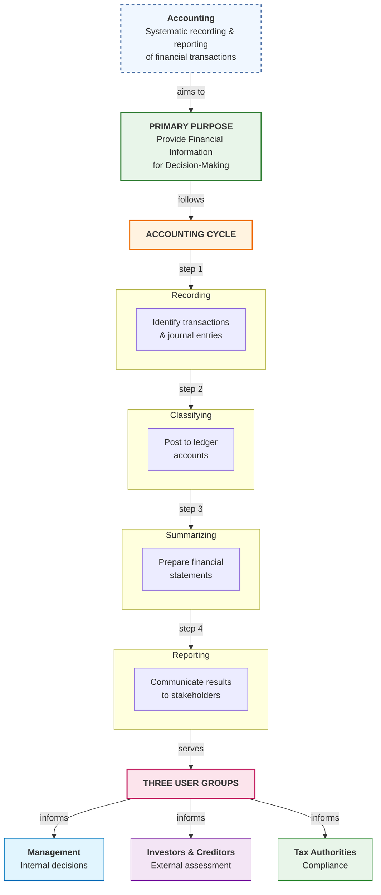

```mermaid
flowchart TD
    A[<b>Accounting</b><br>Systematic recording & reporting<br>of financial transactions]:::title
    B[<b>PRIMARY PURPOSE</b><br>Provide Financial Information<br>for Decision-Making]:::objective
    C[<b>ACCOUNTING CYCLE</b>]:::cycle
    
    subgraph D[Recording]
        D1[Identify transactions<br>& journal entries]
    end
    
    subgraph E[Classifying]
        E1[Post to ledger<br>accounts]
    end
    
    subgraph F[Summarizing]
        F1[Prepare financial<br>statements]
    end
    
    subgraph G[Reporting]
        G1[Communicate results<br>to stakeholders]
    end
    
    H[<b>THREE USER GROUPS</b>]:::users
    
    I[<b>Management</b><br>Internal decisions]:::internal
    J[<b>Investors & Creditors</b><br>External assessment]:::external
    K[<b>Tax Authorities</b><br>Compliance]:::tax
    
    A -->|aims to| B
    B -->|follows| C
    C -->|step 1| D
    D -->|step 2| E
    E -->|step 3| F
    F -->|step 4| G
    G -->|serves| H
    H -->|informs| I
    H -->|informs| J
    H -->|informs| K
    
    classDef title fill:#f0f7ff,stroke:#4a6fa5,stroke-width:2px,color:#333,stroke-dasharray:5 5
    classDef objective fill:#e8f5e9,stroke:#2e7d32,stroke-width:2px,color:#333
    classDef cycle fill:#fff3e0,stroke:#ef6c00,stroke-width:2px,color:#333
    classDef users fill:#fce4ec,stroke:#c2185b,stroke-width:2px,color:#333
    classDef internal fill:#e1f5fe,stroke:#0277bd,stroke-width:1px,color:#333
    classDef external fill:#f3e5f5,stroke:#7b1fa2,stroke-width:1px,color:#333
    classDef tax fill:#e8f5e9,stroke:#388e3c,stroke-width:1px,color:#333
```
