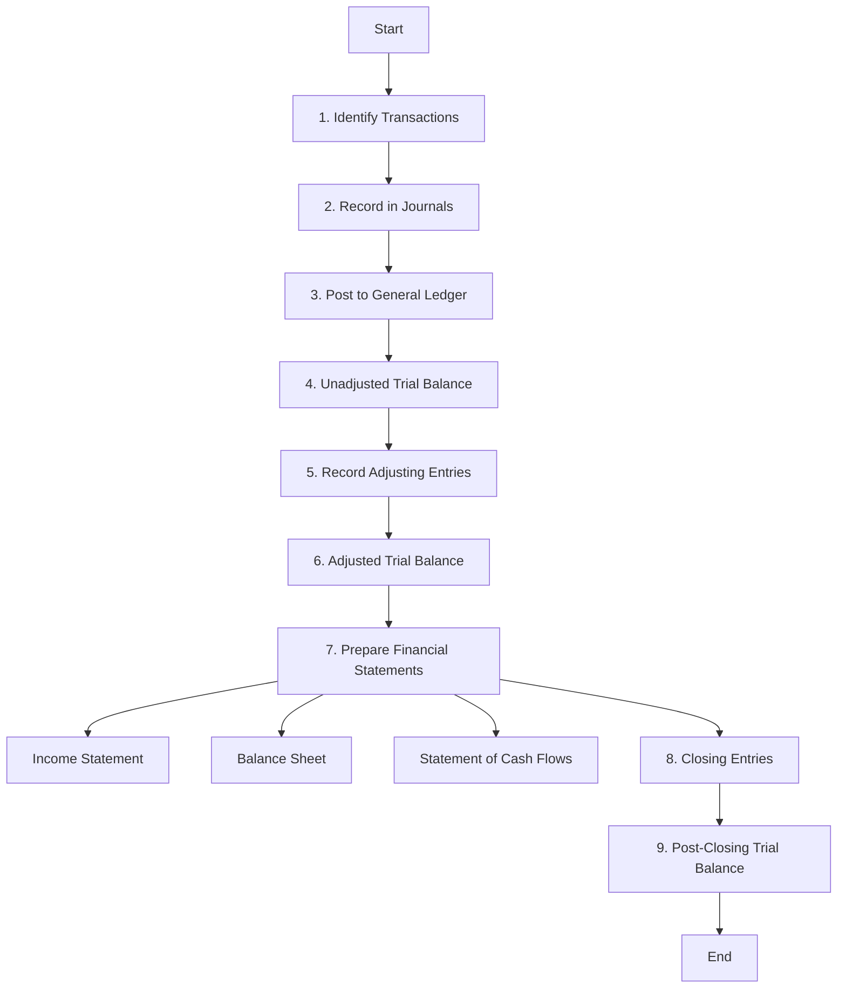

```mermaid
flowchart TD
    A[Start] --> B[1. Identify Transactions]
    B --> C[2. Record in Journals]
    C --> D[3. Post to General Ledger]
    D --> E[4. Unadjusted Trial Balance]
    E --> F[5. Record Adjusting Entries]
    F --> G[6. Adjusted Trial Balance]
    G --> H[7. Prepare Financial Statements]
    H --> I[Income Statement]
    H --> J[Balance Sheet]
    H --> K[Statement of Cash Flows]
    H --> L[8. Closing Entries]
    L --> M[9. Post-Closing Trial Balance]
    M --> N[End]
```
