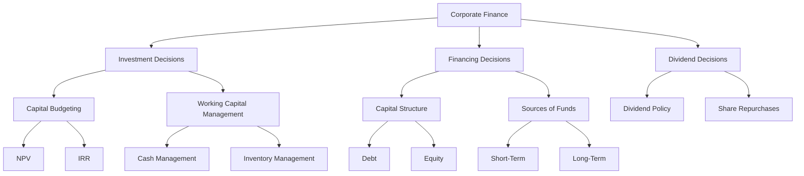

```mermaid
flowchart TD
    A[Corporate Finance] --> B[Investment Decisions]
    A --> C[Financing Decisions]
    A --> D[Dividend Decisions]

    B --> E[Capital Budgeting]
    B --> F[Working Capital Management]

    E --> G[NPV]
    E --> H[IRR]

    F --> I[Cash Management]
    F --> J[Inventory Management]

    C --> K[Capital Structure]
    C --> L[Sources of Funds]

    K --> M[Debt]
    K --> N[Equity]

    L --> O[Short-Term]
    L --> P[Long-Term]

    D --> Q[Dividend Policy]
    D --> R[Share Repurchases]
```
