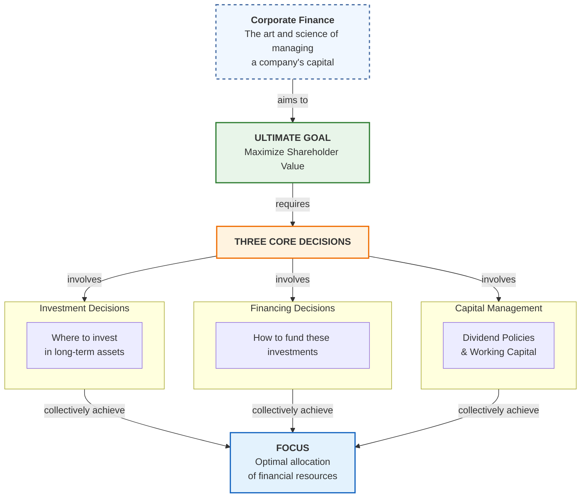

```mermaid
flowchart TD
    A[<b>Corporate Finance</b><br>The art and science of managing<br>a company's capital]:::title
    B[<b>ULTIMATE GOAL</b><br>Maximize Shareholder Value]:::goal
    C[<b>THREE CORE DECISIONS</b>]:::decisions
    
    subgraph D[Investment Decisions]
        D1[Where to invest<br>in long-term assets]
    end
    
    subgraph E[Financing Decisions]
        E1[How to fund these investments]
    end
    
    subgraph F[Capital Management]
        F1[Dividend Policies<br>& Working Capital]
    end
    
    G[<b>FOCUS</b><br>Optimal allocation<br>of financial resources]:::focus
    
    A -->|aims to| B
    B -->|requires| C
    C -->|involves| D
    C -->|involves| E
    C -->|involves| F
    D & E & F -->|collectively achieve| G
    
    classDef title fill:#f0f7ff,stroke:#4a6fa5,stroke-width:2px,color:#333,stroke-dasharray:5 5
    classDef goal fill:#e8f5e9,stroke:#2e7d32,stroke-width:2px,color:#333
    classDef decisions fill:#fff3e0,stroke:#ef6c00,stroke-width:2px,color:#333
    classDef focus fill:#e3f2fd,stroke:#1565c0,stroke-width:2px,color:#333
```
