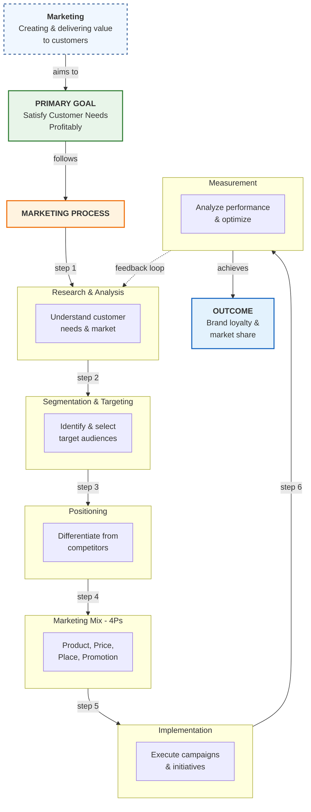

```mermaid
flowchart TD
    A[<b>Marketing</b><br>Creating & delivering value<br>to customers]:::title
    B[<b>PRIMARY GOAL</b><br>Satisfy Customer Needs<br>Profitably]:::goal
    C[<b>MARKETING PROCESS</b>]:::process
    
    subgraph D[Research & Analysis]
        D1[Understand customer<br>needs & market]
    end
    
    subgraph E[Segmentation & Targeting]
        E1[Identify & select<br>target audiences]
    end
    
    subgraph F[Positioning]
        F1[Differentiate from<br>competitors]
    end
    
    subgraph G[Marketing Mix - 4Ps]
        G1[Product, Price,<br>Place, Promotion]
    end
    
    subgraph H[Implementation]
        H1[Execute campaigns<br>& initiatives]
    end
    
    subgraph I[Measurement]
        I1[Analyze performance<br>& optimize]
    end
    
    J[<b>OUTCOME</b><br>Brand loyalty &<br>market share]:::outcome
    
    A -->|aims to| B
    B -->|follows| C
    C -->|step 1| D
    D -->|step 2| E
    E -->|step 3| F
    F -->|step 4| G
    G -->|step 5| H
    H -->|step 6| I
    I -->|achieves| J
    I -.->|feedback loop| D
    
    classDef title fill:#f0f7ff,stroke:#4a6fa5,stroke-width:2px,color:#333,stroke-dasharray:5 5
    classDef goal fill:#e8f5e9,stroke:#2e7d32,stroke-width:2px,color:#333
    classDef process fill:#fff3e0,stroke:#ef6c00,stroke-width:2px,color:#333
    classDef outcome fill:#e3f2fd,stroke:#1565c0,stroke-width:2px,color:#333
```