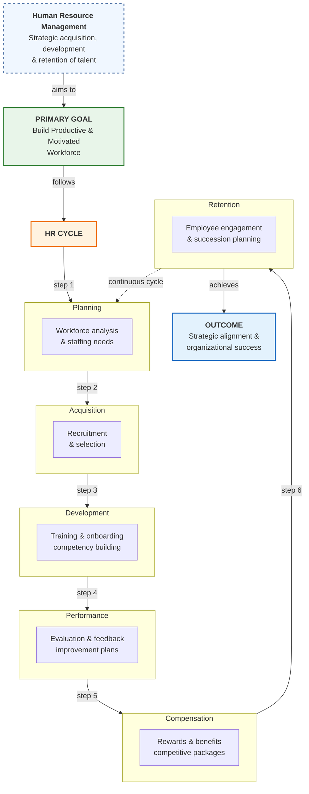

```mermaid
flowchart TD
    A[<b>Human Resource Management</b><br>Strategic acquisition, development<br>& retention of talent]:::title
    B[<b>PRIMARY GOAL</b><br>Build Productive & Motivated<br>Workforce]:::goal
    C[<b>HR CYCLE</b>]:::cycle
    
    subgraph D[Planning]
        D1[Workforce analysis<br>& staffing needs]
    end
    
    subgraph E[Acquisition]
        E1[Recruitment<br>& selection]
    end
    
    subgraph F[Development]
        F1[Training & onboarding<br>competency building]
    end
    
    subgraph G[Performance]
        G1[Evaluation & feedback<br>improvement plans]
    end
    
    subgraph H[Compensation]
        H1[Rewards & benefits<br>competitive packages]
    end
    
    subgraph I[Retention]
        I1[Employee engagement<br>& succession planning]
    end
    
    J[<b>OUTCOME</b><br>Strategic alignment &<br>organizational success]:::outcome
    
    A -->|aims to| B
    B -->|follows| C
    C -->|step 1| D
    D -->|step 2| E
    E -->|step 3| F
    F -->|step 4| G
    G -->|step 5| H
    H -->|step 6| I
    I -->|achieves| J
    I -.->|continuous cycle| D
    
    classDef title fill:#f0f7ff,stroke:#4a6fa5,stroke-width:2px,color:#333,stroke-dasharray:5 5
    classDef goal fill:#e8f5e9,stroke:#2e7d32,stroke-width:2px,color:#333
    classDef cycle fill:#fff3e0,stroke:#ef6c00,stroke-width:2px,color:#333
    classDef outcome fill:#e3f2fd,stroke:#1565c0,stroke-width:2px,color:#333
```
