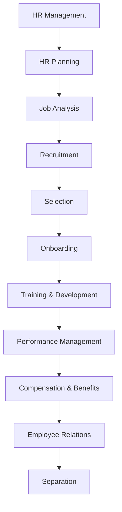

```mermaid
flowchart TD
    A[HR Management] --> B[HR Planning]
    B --> C[Job Analysis]
    C --> D[Recruitment]
    D --> E[Selection]
    E --> F[Onboarding]
    F --> G[Training & Development]
    G --> H[Performance Management]
    H --> I[Compensation & Benefits]
    I --> J[Employee Relations]
    J --> K[Separation]
```
