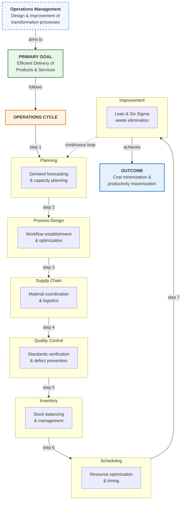

```mermaid
flowchart TD
    A[<b>Operations Management</b><br>Design & improvement of<br>transformation processes]:::title
    B[<b>PRIMARY GOAL</b><br>Efficient Delivery of<br>Products & Services]:::goal
    C[<b>OPERATIONS CYCLE</b>]:::cycle
    
    subgraph D[Planning]
        D1[Demand forecasting<br>& capacity planning]
    end
    
    subgraph E[Process Design]
        E1[Workflow establishment<br>& optimization]
    end
    
    subgraph F[Supply Chain]
        F1[Material coordination<br>& logistics]
    end
    
    subgraph G[Quality Control]
        G1[Standards verification<br>& defect prevention]
    end
    
    subgraph H[Inventory]
        H1[Stock balancing<br>& management]
    end
    
    subgraph I[Scheduling]
        I1[Resource optimization<br>& timing]
    end
    
    subgraph J[Improvement]
        J1[Lean & Six Sigma<br>waste elimination]
    end
    
    K[<b>OUTCOME</b><br>Cost minimization &<br>productivity maximization]:::outcome
    
    A -->|aims to| B
    B -->|follows| C
    C -->|step 1| D
    D -->|step 2| E
    E -->|step 3| F
    F -->|step 4| G
    G -->|step 5| H
    H -->|step 6| I
    I -->|step 7| J
    J -->|achieves| K
    J -.->|continuous loop| D
    
    classDef title fill:#f0f7ff,stroke:#4a6fa5,stroke-width:2px,color:#333,stroke-dasharray:5 5
    classDef goal fill:#e8f5e9,stroke:#2e7d32,stroke-width:2px,color:#333
    classDef cycle fill:#fff3e0,stroke:#ef6c00,stroke-width:2px,color:#333
    classDef outcome fill:#e3f2fd,stroke:#1565c0,stroke-width:2px,color:#333
```
