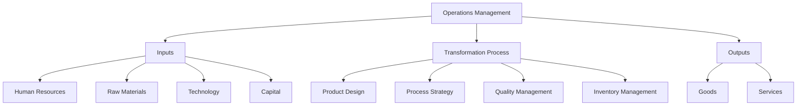

```mermaid
flowchart TD
    A[Operations Management] --> B[Inputs]
    B --> C[Human Resources]
    B --> D[Raw Materials]
    B --> E[Technology]
    B --> F[Capital]

    A --> G[Transformation Process]
    G --> H[Product Design]
    G --> I[Process Strategy]
    G --> J[Quality Management]
    G --> K[Inventory Management]

    A --> L[Outputs]
    L --> M[Goods]
    L --> N[Services]
```
