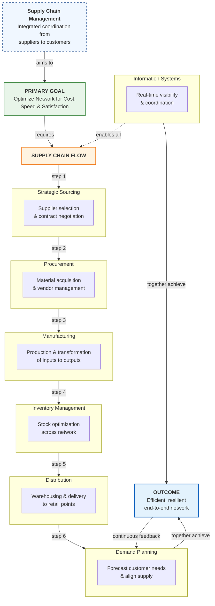

```mermaid
flowchart TD
    A[<b>Supply Chain Management</b><br>Integrated coordination from<br>suppliers to customers]:::title
    B[<b>PRIMARY GOAL</b><br>Optimize Network for Cost,<br>Speed & Satisfaction]:::goal
    C[<b>SUPPLY CHAIN FLOW</b>]:::flow
    
    subgraph D[Strategic Sourcing]
        D1[Supplier selection<br>& contract negotiation]
    end
    
    subgraph E[Procurement]
        E1[Material acquisition<br>& vendor management]
    end
    
    subgraph F[Manufacturing]
        F1[Production & transformation<br>of inputs to outputs]
    end
    
    subgraph G[Inventory Management]
        G1[Stock optimization<br>across network]
    end
    
    subgraph H[Distribution]
        H1[Warehousing & delivery<br>to retail points]
    end
    
    subgraph I[Demand Planning]
        I1[Forecast customer needs<br>& align supply]
    end
    
    subgraph J[Information Systems]
        J1[Real-time visibility<br>& coordination]
    end
    
    K[<b>OUTCOME</b><br>Efficient, resilient<br>end-to-end network]:::outcome
    
    A -->|aims to| B
    B -->|requires| C
    C -->|step 1| D
    D -->|step 2| E
    E -->|step 3| F
    F -->|step 4| G
    G -->|step 5| H
    H -->|step 6| I
    I & J -->|together achieve| K
    J -.->|enables all| C
    K -.->|continuous feedback| I
    
    classDef title fill:#f0f7ff,stroke:#4a6fa5,stroke-width:2px,color:#333,stroke-dasharray:5 5
    classDef goal fill:#e8f5e9,stroke:#2e7d32,stroke-width:2px,color:#333
    classDef flow fill:#fff3e0,stroke:#ef6c00,stroke-width:2px,color:#333
    classDef outcome fill:#e3f2fd,stroke:#1565c0,stroke-width:2px,color:#333
```
