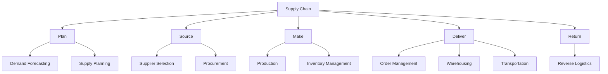

```mermaid
flowchart TD
    A[Supply Chain] --> B[Plan]
    B --> C[Demand Forecasting]
    B --> D[Supply Planning]

    A --> E[Source]
    E --> F[Supplier Selection]
    E --> G[Procurement]

    A --> H[Make]
    H --> I[Production]
    H --> J[Inventory Management]

    A --> K[Deliver]
    K --> L[Order Management]
    K --> M[Warehousing]
    K --> N[Transportation]

    A --> O[Return]
    O --> P[Reverse Logistics]
```
