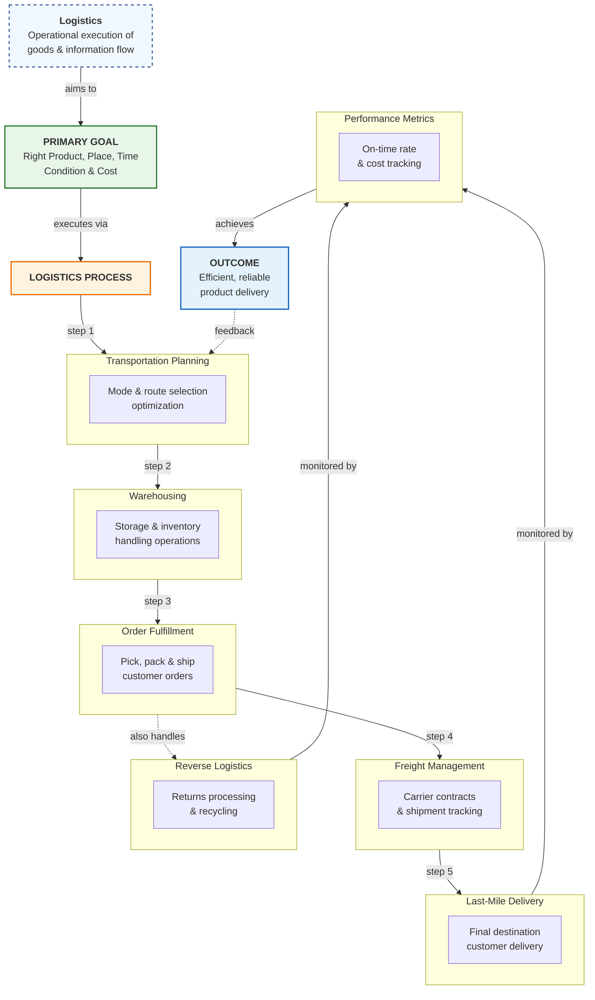

```mermaid
flowchart TD
    A[<b>Logistics</b><br>Operational execution of<br>goods & information flow]:::title
    B[<b>PRIMARY GOAL</b><br>Right Product, Place, Time<br>Condition & Cost]:::goal
    C[<b>LOGISTICS PROCESS</b>]:::process
    
    subgraph D[Transportation Planning]
        D1[Mode & route selection<br>optimization]
    end
    
    subgraph E[Warehousing]
        E1[Storage & inventory<br>handling operations]
    end
    
    subgraph F[Order Fulfillment]
        F1[Pick, pack & ship<br>customer orders]
    end
    
    subgraph G[Freight Management]
        G1[Carrier contracts<br>& shipment tracking]
    end
    
    subgraph H[Reverse Logistics]
        H1[Returns processing<br>& recycling]
    end
    
    subgraph I[Last-Mile Delivery]
        I1[Final destination<br>customer delivery]
    end
    
    subgraph J[Performance Metrics]
        J1[On-time rate<br>& cost tracking]
    end
    
    K[<b>OUTCOME</b><br>Efficient, reliable<br>product delivery]:::outcome
    
    A -->|aims to| B
    B -->|executes via| C
    C -->|step 1| D
    D -->|step 2| E
    E -->|step 3| F
    F -->|step 4| G
    G -->|step 5| I
    F -.->|also handles| H
    I & H -->|monitored by| J
    J -->|achieves| K
    K -.->|feedback| D
    
    classDef title fill:#f0f7ff,stroke:#4a6fa5,stroke-width:2px,color:#333,stroke-dasharray:5 5
    classDef goal fill:#e8f5e9,stroke:#2e7d32,stroke-width:2px,color:#333
    classDef process fill:#fff3e0,stroke:#ef6c00,stroke-width:2px,color:#333
    classDef outcome fill:#e3f2fd,stroke:#1565c0,stroke-width:2px,color:#333
```
