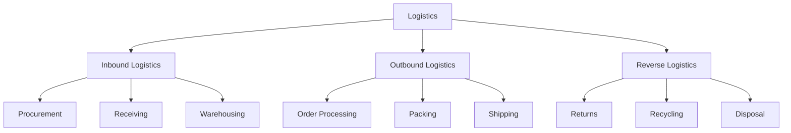

```mermaid
flowchart TD
    A[Logistics] --> B[Inbound Logistics]
    B --> C[Procurement]
    B --> D[Receiving]
    B --> E[Warehousing]

    A --> F[Outbound Logistics]
    F --> G[Order Processing]
    F --> H[Packing]
    F --> I[Shipping]

    A --> J[Reverse Logistics]
    J --> K[Returns]
    J --> L[Recycling]
    J --> M[Disposal]
```
