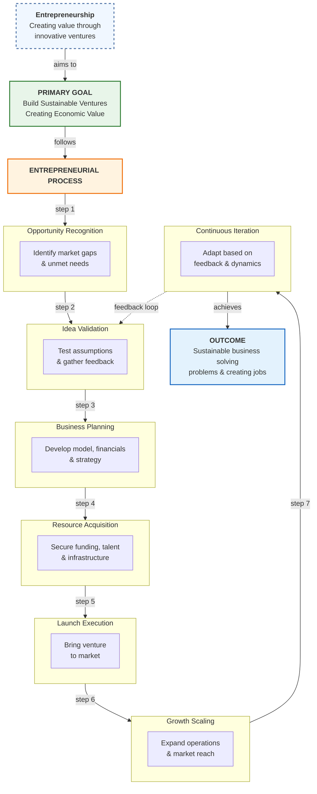

```mermaid
flowchart TD
    A[<b>Entrepreneurship</b><br>Creating value through<br>innovative ventures]:::title
    B[<b>PRIMARY GOAL</b><br>Build Sustainable Ventures<br>Creating Economic Value]:::goal
    C[<b>ENTREPRENEURIAL PROCESS</b>]:::process
    
    subgraph D[Opportunity Recognition]
        D1[Identify market gaps<br>& unmet needs]
    end
    
    subgraph E[Idea Validation]
        E1[Test assumptions<br>& gather feedback]
    end
    
    subgraph F[Business Planning]
        F1[Develop model, financials<br>& strategy]
    end
    
    subgraph G[Resource Acquisition]
        G1[Secure funding, talent<br>& infrastructure]
    end
    
    subgraph H[Launch Execution]
        H1[Bring venture<br>to market]
    end
    
    subgraph I[Growth Scaling]
        I1[Expand operations<br>& market reach]
    end
    
    subgraph J[Continuous Iteration]
        J1[Adapt based on<br>feedback & dynamics]
    end
    
    K[<b>OUTCOME</b><br>Sustainable business solving<br>problems & creating jobs]:::outcome
    
    A -->|aims to| B
    B -->|follows| C
    C -->|step 1| D
    D -->|step 2| E
    E -->|step 3| F
    F -->|step 4| G
    G -->|step 5| H
    H -->|step 6| I
    I -->|step 7| J
    J -->|achieves| K
    J -.->|feedback loop| E
    
    classDef title fill:#f0f7ff,stroke:#4a6fa5,stroke-width:2px,color:#333,stroke-dasharray:5 5
    classDef goal fill:#e8f5e9,stroke:#2e7d32,stroke-width:2px,color:#333
    classDef process fill:#fff3e0,stroke:#ef6c00,stroke-width:2px,color:#333
    classDef outcome fill:#e3f2fd,stroke:#1565c0,stroke-width:2px,color:#333
```
