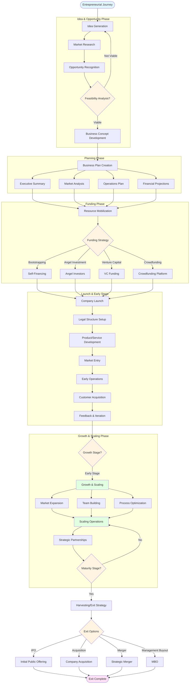

```mermaid
flowchart TD
    Start([Entrepreneurial Journey]) --> A[Idea Generation]
    A --> B[Market Research]
    B --> C[Opportunity Recognition]
    C --> D{Feasibility Analysis?}
    D -->|Not Viable| A
    D -->|Viable| E[Business Concept Development]
    E --> F[Business Plan Creation]
    F --> G[Executive Summary]
    F --> H[Market Analysis]
    F --> I[Operations Plan]
    F --> J[Financial Projections]
    G --> K[Resource Mobilization]
    H --> K
    I --> K
    J --> K
    K --> L{Funding Strategy}
    L -->|Bootstrapping| M[Self-Financing]
    L -->|Angel Investment| N[Angel Investors]
    L -->|Venture Capital| O[VC Funding]
    L -->|Crowdfunding| P[Crowdfunding Platform]
    M --> Q[Company Launch]
    N --> Q
    O --> Q
    P --> Q
    Q --> R[Legal Structure Setup]
    R --> S[Product/Service Development]
    S --> T[Market Entry]
    T --> U[Early Operations]
    U --> V[Customer Acquisition]
    V --> W[Feedback & Iteration]
    W --> X{Growth Stage?}
    X -->|Early Stage| Y[Growth & Scaling]
    Y --> Z[Market Expansion]
    Y --> AA[Team Building]
    Y --> BB[Process Optimization]
    Z --> CC[Scaling Operations]
    AA --> CC
    BB --> CC
    CC --> DD[Strategic Partnerships]
    DD --> EE{Maturity Stage?}
    EE -->|Yes| FF[Harvesting/Exit Strategy]
    EE -->|No| CC
    FF --> GG{Exit Options}
    GG -->|IPO| HH[Initial Public Offering]
    GG -->|Acquisition| II[Company Acquisition]
    GG -->|Merger| JJ[Strategic Merger]
    GG -->|Management Buyout| KK[MBO]
    HH --> End([Exit Complete])
    II --> End
    JJ --> End
    KK --> End
    
    subgraph Idea_Phase["Idea & Opportunity Phase"]
        A
        B
        C
        D
        E
    end
    
    subgraph Planning_Phase["Planning Phase"]
        F
        G
        H
        I
        J
    end
    
    subgraph Funding_Phase["Funding Phase"]
        K
        L
        M
        N
        O
        P
    end
    
    subgraph Launch_Phase["Launch & Early Stage"]
        Q
        R
        S
        T
        U
        V
        W
    end
    
    subgraph Growth_Phase["Growth & Scaling Phase"]
        X
        Y
        Z
        AA
        BB
        CC
        DD
        EE
    end
    
    style Start fill:#e1f5ff
    style End fill:#ffe1f5
    style D fill:#fff4e1
    style L fill:#fff4e1
    style X fill:#fff4e1
    style EE fill:#fff4e1
    style GG fill:#fff4e1
    style Y fill:#e1ffe1
    style CC fill:#e1ffe1
```
