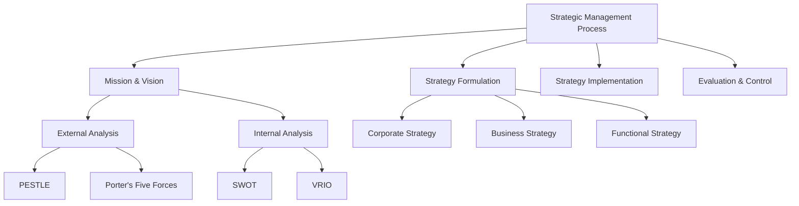

```mermaid
flowchart TD
    A[Strategic Management Process] --> B[Mission & Vision]
    B --> C[External Analysis]
    C --> D[PESTLE]
    C --> E[Porter's Five Forces]
    B --> F[Internal Analysis]
    F --> G[SWOT]
    F --> H[VRIO]
    A --> I[Strategy Formulation]
    I --> J[Corporate Strategy]
    I --> K[Business Strategy]
    I --> L[Functional Strategy]
    A --> M[Strategy Implementation]
    A --> N[Evaluation & Control]
```
