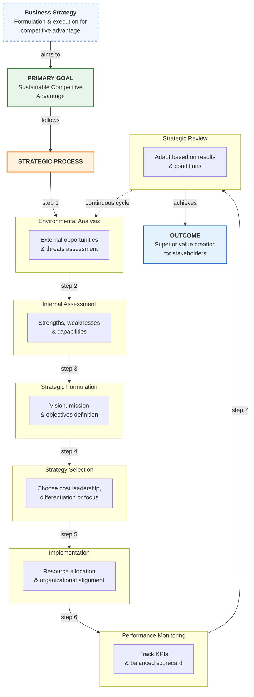

```mermaid
flowchart TD
    A[<b>Business Strategy</b><br>Formulation & execution for<br>competitive advantage]:::title
    B[<b>PRIMARY GOAL</b><br>Sustainable Competitive<br>Advantage]:::goal
    C[<b>STRATEGIC PROCESS</b>]:::process
    
    subgraph D[Environmental Analysis]
        D1[External opportunities<br>& threats assessment]
    end
    
    subgraph E[Internal Assessment]
        E1[Strengths, weaknesses<br>& capabilities]
    end
    
    subgraph F[Strategic Formulation]
        F1[Vision, mission<br>& objectives definition]
    end
    
    subgraph G[Strategy Selection]
        G1[Choose cost leadership,<br>differentiation or focus]
    end
    
    subgraph H[Implementation]
        H1[Resource allocation<br>& organizational alignment]
    end
    
    subgraph I[Performance Monitoring]
        I1[Track KPIs<br>& balanced scorecard]
    end
    
    subgraph J[Strategic Review]
        J1[Adapt based on results<br>& conditions]
    end
    
    K[<b>OUTCOME</b><br>Superior value creation<br>for stakeholders]:::outcome
    
    A -->|aims to| B
    B -->|follows| C
    C -->|step 1| D
    D -->|step 2| E
    E -->|step 3| F
    F -->|step 4| G
    G -->|step 5| H
    H -->|step 6| I
    I -->|step 7| J
    J -->|achieves| K
    J -.->|continuous cycle| D
    
    classDef title fill:#f0f7ff,stroke:#4a6fa5,stroke-width:2px,color:#333,stroke-dasharray:5 5
    classDef goal fill:#e8f5e9,stroke:#2e7d32,stroke-width:2px,color:#333
    classDef process fill:#fff3e0,stroke:#ef6c00,stroke-width:2px,color:#333
    classDef outcome fill:#e3f2fd,stroke:#1565c0,stroke-width:2px,color:#333
```
