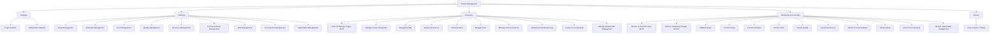

```mermaid
flowchart TD
    A[Project Management] --> B[Initiating]
    B --> C[Project Charter]
    B --> D[Stakeholder Register]

    A --> E[Planning]
    E --> F[Scope Management]
    E --> G[Schedule Management]
    E --> H[Cost Management]
    E --> I[Quality Management]
    E --> J[Resource Management]
    E --> K[Communications Management]
    E --> L[Risk Management]
    E --> M[Procurement Management]
    E --> N[Stakeholder Management]

    A --> O[Executing]
    O --> P[Direct & Manage Project Work]
    O --> Q[Manage Project Knowledge]
    O --> R[Manage Quality]
    O --> S[Acquire Resources]
    O --> T[Develop Team]
    O --> U[Manage Team]
    O --> V[Manage Communications]
    O --> W[Implement Risk Responses]
    O --> X[Conduct Procurements]
    O --> Y[Manage Stakeholder Engagement]

    A --> Z[Monitoring & Controlling]
    Z --> AA[Monitor & Control Project Work]
    Z --> AB[Perform Integrated Change Control]
    Z --> AC[Validate Scope]
    Z --> AD[Control Scope]
    Z --> AE[Control Schedule]
    Z --> AF[Control Costs]
    Z --> AG[Control Quality]
    Z --> AH[Control Resources]
    Z --> AI[Monitor Communications]
    Z --> AJ[Monitor Risks]
    Z --> AK[Control Procurements]
    Z --> AL[Monitor Stakeholder Engagement]

    A --> AM[Closing]
    AM --> AN[Close Project or Phase]
```
