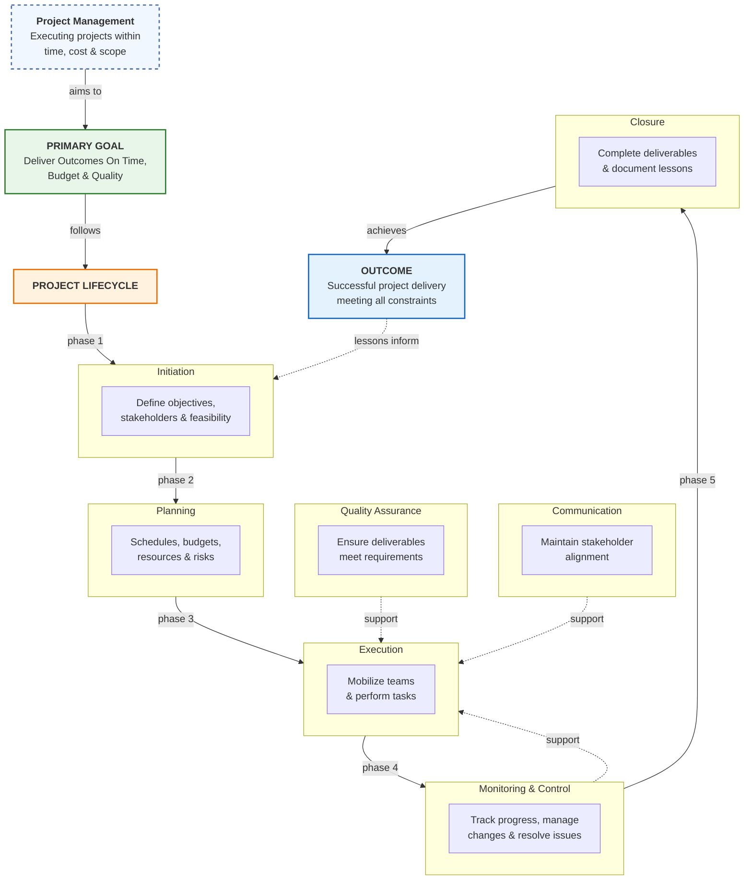

```mermaid
flowchart TD
    A[<b>Project Management</b><br>Executing projects within<br>time, cost & scope]:::title
    B[<b>PRIMARY GOAL</b><br>Deliver Outcomes On Time,<br>Budget & Quality]:::goal
    C[<b>PROJECT LIFECYCLE</b>]:::lifecycle
    
    subgraph D[Initiation]
        D1[Define objectives,<br>stakeholders & feasibility]
    end
    
    subgraph E[Planning]
        E1[Schedules, budgets,<br>resources & risks]
    end
    
    subgraph F[Execution]
        F1[Mobilize teams<br>& perform tasks]
    end
    
    subgraph G[Monitoring & Control]
        G1[Track progress, manage<br>changes & resolve issues]
    end
    
    subgraph H[Quality Assurance]
        H1[Ensure deliverables<br>meet requirements]
    end
    
    subgraph I[Communication]
        I1[Maintain stakeholder<br>alignment]
    end
    
    subgraph J[Closure]
        J1[Complete deliverables<br>& document lessons]
    end
    
    K[<b>OUTCOME</b><br>Successful project delivery<br>meeting all constraints]:::outcome
    
    A -->|aims to| B
    B -->|follows| C
    C -->|phase 1| D
    D -->|phase 2| E
    E -->|phase 3| F
    F -->|phase 4| G
    G & H & I -.->|support| F
    G -->|phase 5| J
    J -->|achieves| K
    K -.->|lessons inform| D
    
    classDef title fill:#f0f7ff,stroke:#4a6fa5,stroke-width:2px,color:#333,stroke-dasharray:5 5
    classDef goal fill:#e8f5e9,stroke:#2e7d32,stroke-width:2px,color:#333
    classDef lifecycle fill:#fff3e0,stroke:#ef6c00,stroke-width:2px,color:#333
    classDef outcome fill:#e3f2fd,stroke:#1565c0,stroke-width:2px,color:#333
```
