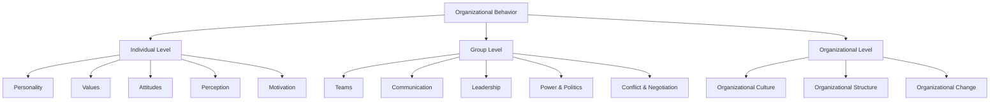

```mermaid
flowchart TD
    A[Organizational Behavior] --> B[Individual Level]
    B --> C[Personality]
    B --> D[Values]
    B --> E[Attitudes]
    B --> F[Perception]
    B --> G[Motivation]

    A --> H[Group Level]
    H --> I[Teams]
    H --> J[Communication]
    H --> K[Leadership]
    H --> L[Power & Politics]
    H --> M[Conflict & Negotiation]

    A --> N[Organizational Level]
    N --> O[Organizational Culture]
    N --> P[Organizational Structure]
    N --> Q[Organizational Change]
```
