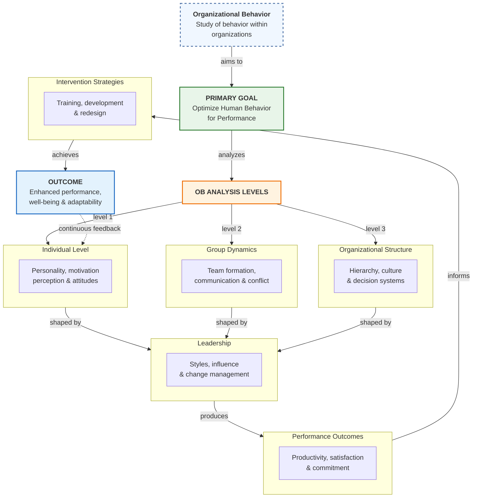

```mermaid
flowchart TD
    A[<b>Organizational Behavior</b><br>Study of behavior within<br>organizations]:::title
    B[<b>PRIMARY GOAL</b><br>Optimize Human Behavior<br>for Performance]:::goal
    C[<b>OB ANALYSIS LEVELS</b>]:::levels
    
    subgraph D[Individual Level]
        D1[Personality, motivation<br>perception & attitudes]
    end
    
    subgraph E[Group Dynamics]
        E1[Team formation,<br>communication & conflict]
    end
    
    subgraph F[Organizational Structure]
        F1[Hierarchy, culture<br>& decision systems]
    end
    
    subgraph G[Leadership]
        G1[Styles, influence<br>& change management]
    end
    
    subgraph H[Performance Outcomes]
        H1[Productivity, satisfaction<br>& commitment]
    end
    
    subgraph I[Intervention Strategies]
        I1[Training, development<br>& redesign]
    end
    
    J[<b>OUTCOME</b><br>Enhanced performance,<br>well-being & adaptability]:::outcome
    
    A -->|aims to| B
    B -->|analyzes| C
    C -->|level 1| D
    C -->|level 2| E
    C -->|level 3| F
    D & E & F -->|shaped by| G
    G -->|produces| H
    H -->|informs| I
    I -->|achieves| J
    J -.->|continuous feedback| D
    
    classDef title fill:#f0f7ff,stroke:#4a6fa5,stroke-width:2px,color:#333,stroke-dasharray:5 5
    classDef goal fill:#e8f5e9,stroke:#2e7d32,stroke-width:2px,color:#333
    classDef levels fill:#fff3e0,stroke:#ef6c00,stroke-width:2px,color:#333
    classDef outcome fill:#e3f2fd,stroke:#1565c0,stroke-width:2px,color:#333
```
