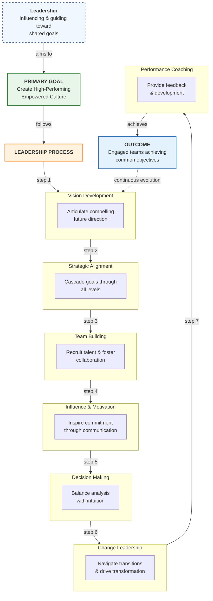

```mermaid
flowchart TD
    A[<b>Leadership</b><br>Influencing & guiding toward<br>shared goals]:::title
    B[<b>PRIMARY GOAL</b><br>Create High-Performing<br>Empowered Culture]:::goal
    C[<b>LEADERSHIP PROCESS</b>]:::process
    
    subgraph D[Vision Development]
        D1[Articulate compelling<br>future direction]
    end
    
    subgraph E[Strategic Alignment]
        E1[Cascade goals through<br>all levels]
    end
    
    subgraph F[Team Building]
        F1[Recruit talent & foster<br>collaboration]
    end
    
    subgraph G[Influence & Motivation]
        G1[Inspire commitment<br>through communication]
    end
    
    subgraph H[Decision Making]
        H1[Balance analysis<br>with intuition]
    end
    
    subgraph I[Change Leadership]
        I1[Navigate transitions<br>& drive transformation]
    end
    
    subgraph J[Performance Coaching]
        J1[Provide feedback<br>& development]
    end
    
    K[<b>OUTCOME</b><br>Engaged teams achieving<br>common objectives]:::outcome
    
    A -->|aims to| B
    B -->|follows| C
    C -->|step 1| D
    D -->|step 2| E
    E -->|step 3| F
    F -->|step 4| G
    G -->|step 5| H
    H -->|step 6| I
    I -->|step 7| J
    J -->|achieves| K
    K -.->|continuous evolution| D
    
    classDef title fill:#f0f7ff,stroke:#4a6fa5,stroke-width:2px,color:#333,stroke-dasharray:5 5
    classDef goal fill:#e8f5e9,stroke:#2e7d32,stroke-width:2px,color:#333
    classDef process fill:#fff3e0,stroke:#ef6c00,stroke-width:2px,color:#333
    classDef outcome fill:#e3f2fd,stroke:#1565c0,stroke-width:2px,color:#333
```
