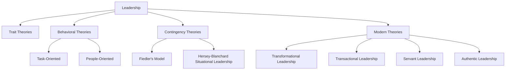

```mermaid
flowchart TD
    A[Leadership] --> B[Trait Theories]
    A --> C[Behavioral Theories]
    C --> D[Task-Oriented]
    C --> E[People-Oriented]
    A --> F[Contingency Theories]
    F --> G[Fiedler's Model]
    F --> H[Hersey-Blanchard Situational Leadership]
    A --> I[Modern Theories]
    I --> J[Transformational Leadership]
    I --> K[Transactional Leadership]
    I --> L[Servant Leadership]
    I --> M[Authentic Leadership]
```
