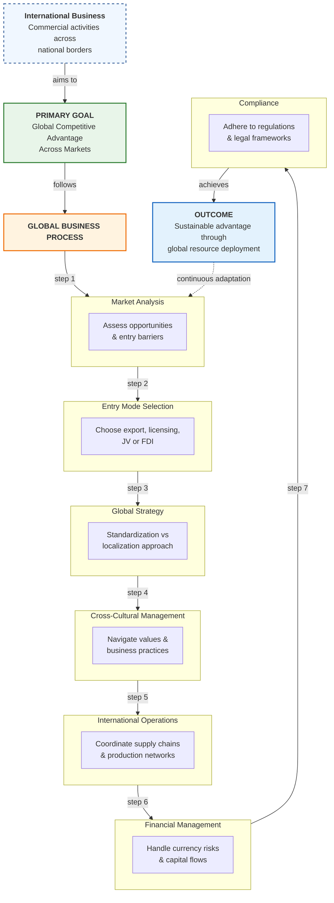

```mermaid
flowchart TD
    A[<b>International Business</b><br>Commercial activities across<br>national borders]:::title
    B[<b>PRIMARY GOAL</b><br>Global Competitive Advantage<br>Across Markets]:::goal
    C[<b>GLOBAL BUSINESS PROCESS</b>]:::process
    
    subgraph D[Market Analysis]
        D1[Assess opportunities<br>& entry barriers]
    end
    
    subgraph E[Entry Mode Selection]
        E1[Choose export, licensing,<br>JV or FDI]
    end
    
    subgraph F[Global Strategy]
        F1[Standardization vs<br>localization approach]
    end
    
    subgraph G[Cross-Cultural Management]
        G1[Navigate values &<br>business practices]
    end
    
    subgraph H[International Operations]
        H1[Coordinate supply chains<br>& production networks]
    end
    
    subgraph I[Financial Management]
        I1[Handle currency risks<br>& capital flows]
    end
    
    subgraph J[Compliance]
        J1[Adhere to regulations<br>& legal frameworks]
    end
    
    K[<b>OUTCOME</b><br>Sustainable advantage through<br>global resource deployment]:::outcome
    
    A -->|aims to| B
    B -->|follows| C
    C -->|step 1| D
    D -->|step 2| E
    E -->|step 3| F
    F -->|step 4| G
    G -->|step 5| H
    H -->|step 6| I
    I -->|step 7| J
    J -->|achieves| K
    K -.->|continuous adaptation| D
    
    classDef title fill:#f0f7ff,stroke:#4a6fa5,stroke-width:2px,color:#333,stroke-dasharray:5 5
    classDef goal fill:#e8f5e9,stroke:#2e7d32,stroke-width:2px,color:#333
    classDef process fill:#fff3e0,stroke:#ef6c00,stroke-width:2px,color:#333
    classDef outcome fill:#e3f2fd,stroke:#1565c0,stroke-width:2px,color:#333
```
