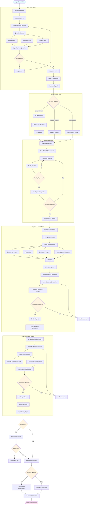

```mermaid
flowchart TD
    Start([Foreign Trade Initiated]) --> A[Inquiry from Buyer]
    A --> B[Market Research]
    B --> C[Seller Prepares Quotation]
    C --> D[Quotation Details]
    D --> E[Price & Terms]
    D --> F[Payment Terms]
    D --> G[Delivery Terms]
    E --> H[Buyer Reviews Quotation]
    F --> H
    G --> H
    H --> I{Acceptable?}
    I -->|No| J[Negotiation]
    J --> C
    I -->|Yes| K[Purchase Order]
    K --> L[Order Confirmation]
    L --> M[Contract Signed]
    M --> N{Payment Method?}
    N -->|Letter of Credit| O[LC Application]
    N -->|Advance Payment| P[Advance Payment]
    N -->|Open Account| Q[Open Account Terms]
    O --> R[LC Issuance by Bank]
    R --> S[LC Advising]
    S --> T[Production Planning]
    P --> T
    Q --> T
    T --> U[Raw Material Procurement]
    U --> V[Production Process]
    V --> W[Quality Control]
    W --> X{Quality Approved?}
    X -->|No| V
    X -->|Yes| Y[Pre-shipment Inspection]
    Y --> Z{Inspection Passed?}
    Z -->|No| V
    Z -->|Yes| AA[Packaging & Labeling]
    AA --> AB[Shipping Arrangement]
    AB --> AC[Transportation Mode]
    AC --> AD[Export Documentation]
    AD --> AE[Commercial Invoice]
    AD --> AF[Packing List]
    AD --> AG[Certificate of Origin]
    AD --> AH[Export License if Required]
    AE --> AI[Shipping]
    AF --> AI
    AG --> AI
    AH --> AI
    AI --> AJ[Bill of Lading/AWB]
    AJ --> AK[Documentation Completion]
    AK --> AL[Export Customs Declaration]
    AL --> AM[Customs Clearance at Origin]
    AM --> AN{Clearance Approved?}
    AN -->|No| AO[Address Issues]
    AO --> AL
    AN -->|Yes| AP[Goods Shipped]
    AP --> AQ[Transportation to Destination]
    AQ --> AR[Arrival at Destination Port]
    AR --> AS[Import Customs Declaration]
    AS --> AT[Import Documentation]
    AT --> AU[Import License if Required]
    AT --> AV[Customs Duties Payment]
    AU --> AW[Import Customs Clearance]
    AV --> AW
    AW --> AX{Clearance Approved?}
    AX -->|No| AY[Address Issues]
    AY --> AS
    AX -->|Yes| AZ[Delivery to Buyer]
    AZ --> BA[Goods Received]
    BA --> BB[Inspection by Buyer]
    BB --> BC{Acceptable?}
    BC -->|No| BD[Dispute Resolution]
    BD --> BE{Resolved?}
    BE -->|No| BF[Claims Process]
    BE -->|Yes| BG[Payment Processing]
    BC -->|Yes| BG
    BG --> BH{Payment Method?}
    BH -->|LC| BI[LC Documents Presentation]
    BH -->|Other| BJ[Payment Settlement]
    BI --> BK[LC Payment Received]
    BJ --> BK
    BK --> End([Transaction Complete])
    
    subgraph Pre_Trade["Pre-Trade Phase"]
        A
        B
        C
        D
        E
        F
        G
        H
        I
        J
        K
        L
        M
    end
    
    subgraph Payment_Setup["Payment Setup Phase"]
        N
        O
        P
        Q
        R
        S
    end
    
    subgraph Production_Phase["Production Phase"]
        T
        U
        V
        W
        X
        Y
        Z
        AA
    end
    
    subgraph Shipping_Phase["Shipping & Export Phase"]
        AB
        AC
        AD
        AE
        AF
        AG
        AH
        AI
        AJ
        AK
        AL
        AM
        AN
        AP
        AQ
    end
    
    subgraph Import_Phase["Import & Delivery Phase"]
        AR
        AS
        AT
        AU
        AV
        AW
        AX
        AZ
        BA
        BB
    end
    
    style Start fill:#e1f5ff
    style End fill:#ffe1f5
    style I fill:#fff4e1
    style N fill:#fff4e1
    style X fill:#fff4e1
    style Z fill:#fff4e1
    style AN fill:#fff4e1
    style AX fill:#fff4e1
    style BC fill:#fff4e1
    style BE fill:#fff4e1
    style BH fill:#fff4e1
```
