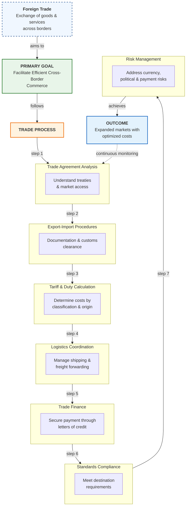

```mermaid
flowchart TD
    A[<b>Foreign Trade</b><br>Exchange of goods & services<br>across borders]:::title
    B[<b>PRIMARY GOAL</b><br>Facilitate Efficient Cross-Border<br>Commerce]:::goal
    C[<b>TRADE PROCESS</b>]:::process
    
    subgraph D[Trade Agreement Analysis]
        D1[Understand treaties<br>& market access]
    end
    
    subgraph E[Export-Import Procedures]
        E1[Documentation & customs<br>clearance]
    end
    
    subgraph F[Tariff & Duty Calculation]
        F1[Determine costs by<br>classification & origin]
    end
    
    subgraph G[Logistics Coordination]
        G1[Manage shipping &<br>freight forwarding]
    end
    
    subgraph H[Trade Finance]
        H1[Secure payment through<br>letters of credit]
    end
    
    subgraph I[Standards Compliance]
        I1[Meet destination<br>requirements]
    end
    
    subgraph J[Risk Management]
        J1[Address currency,<br>political & payment risks]
    end
    
    K[<b>OUTCOME</b><br>Expanded markets with<br>optimized costs]:::outcome
    
    A -->|aims to| B
    B -->|follows| C
    C -->|step 1| D
    D -->|step 2| E
    E -->|step 3| F
    F -->|step 4| G
    G -->|step 5| H
    H -->|step 6| I
    I -->|step 7| J
    J -->|achieves| K
    K -.->|continuous monitoring| D
    
    classDef title fill:#f0f7ff,stroke:#4a6fa5,stroke-width:2px,color:#333,stroke-dasharray:5 5
    classDef goal fill:#e8f5e9,stroke:#2e7d32,stroke-width:2px,color:#333
    classDef process fill:#fff3e0,stroke:#ef6c00,stroke-width:2px,color:#333
    classDef outcome fill:#e3f2fd,stroke:#1565c0,stroke-width:2px,color:#333
```
