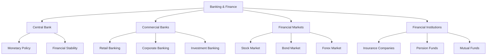

```mermaid
flowchart TD
    A[Banking & Finance] --> B[Central Bank]
    B --> C[Monetary Policy]
    B --> D[Financial Stability]

    A --> E[Commercial Banks]
    E --> F[Retail Banking]
    E --> G[Corporate Banking]
    E --> H[Investment Banking]

    A --> I[Financial Markets]
    I --> J[Stock Market]
    I --> K[Bond Market]
    I --> L[Forex Market]

    A --> M[Financial Institutions]
    M --> N[Insurance Companies]
    M --> O[Pension Funds]
    M --> P[Mutual Funds]
```
