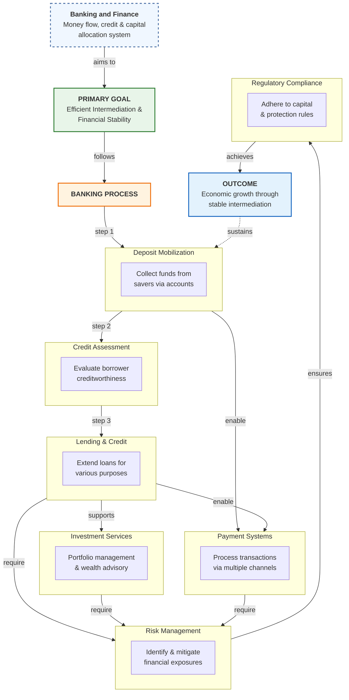

```mermaid
flowchart TD
    A[<b>Banking and Finance</b><br>Money flow, credit & capital<br>allocation system]:::title
    B[<b>PRIMARY GOAL</b><br>Efficient Intermediation &<br>Financial Stability]:::goal
    C[<b>BANKING PROCESS</b>]:::process
    
    subgraph D[Deposit Mobilization]
        D1[Collect funds from<br>savers via accounts]
    end
    
    subgraph E[Credit Assessment]
        E1[Evaluate borrower<br>creditworthiness]
    end
    
    subgraph F[Lending & Credit]
        F1[Extend loans for<br>various purposes]
    end
    
    subgraph G[Investment Services]
        G1[Portfolio management<br>& wealth advisory]
    end
    
    subgraph H[Payment Systems]
        H1[Process transactions<br>via multiple channels]
    end
    
    subgraph I[Risk Management]
        I1[Identify & mitigate<br>financial exposures]
    end
    
    subgraph J[Regulatory Compliance]
        J1[Adhere to capital<br>& protection rules]
    end
    
    K[<b>OUTCOME</b><br>Economic growth through<br>stable intermediation]:::outcome
    
    A -->|aims to| B
    B -->|follows| C
    C -->|step 1| D
    D -->|step 2| E
    E -->|step 3| F
    F -->|supports| G
    D & F -->|enable| H
    F & G & H -->|require| I
    I -->|ensures| J
    J -->|achieves| K
    K -.->|sustains| D
    
    classDef title fill:#f0f7ff,stroke:#4a6fa5,stroke-width:2px,color:#333,stroke-dasharray:5 5
    classDef goal fill:#e8f5e9,stroke:#2e7d32,stroke-width:2px,color:#333
    classDef process fill:#fff3e0,stroke:#ef6c00,stroke-width:2px,color:#333
    classDef outcome fill:#e3f2fd,stroke:#1565c0,stroke-width:2px,color:#333
```
