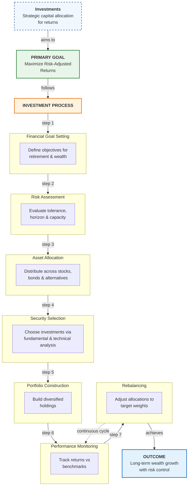

```mermaid
flowchart TD
    A[<b>Investments</b><br>Strategic capital allocation<br>for returns]:::title
    B[<b>PRIMARY GOAL</b><br>Maximize Risk-Adjusted<br>Returns]:::goal
    C[<b>INVESTMENT PROCESS</b>]:::process
    
    subgraph D[Financial Goal Setting]
        D1[Define objectives for<br>retirement & wealth]
    end
    
    subgraph E[Risk Assessment]
        E1[Evaluate tolerance,<br>horizon & capacity]
    end
    
    subgraph F[Asset Allocation]
        F1[Distribute across stocks,<br>bonds & alternatives]
    end
    
    subgraph G[Security Selection]
        G1[Choose investments via<br>fundamental & technical analysis]
    end
    
    subgraph H[Portfolio Construction]
        H1[Build diversified<br>holdings]
    end
    
    subgraph I[Performance Monitoring]
        I1[Track returns vs<br>benchmarks]
    end
    
    subgraph J[Rebalancing]
        J1[Adjust allocations to<br>target weights]
    end
    
    K[<b>OUTCOME</b><br>Long-term wealth growth<br>with risk control]:::outcome
    
    A -->|aims to| B
    B -->|follows| C
    C -->|step 1| D
    D -->|step 2| E
    E -->|step 3| F
    F -->|step 4| G
    G -->|step 5| H
    H -->|step 6| I
    I -->|step 7| J
    J -->|achieves| K
    J -.->|continuous cycle| I
    
    classDef title fill:#f0f7ff,stroke:#4a6fa5,stroke-width:2px,color:#333,stroke-dasharray:5 5
    classDef goal fill:#e8f5e9,stroke:#2e7d32,stroke-width:2px,color:#333
    classDef process fill:#fff3e0,stroke:#ef6c00,stroke-width:2px,color:#333
    classDef outcome fill:#e3f2fd,stroke:#1565c0,stroke-width:2px,color:#333
```
