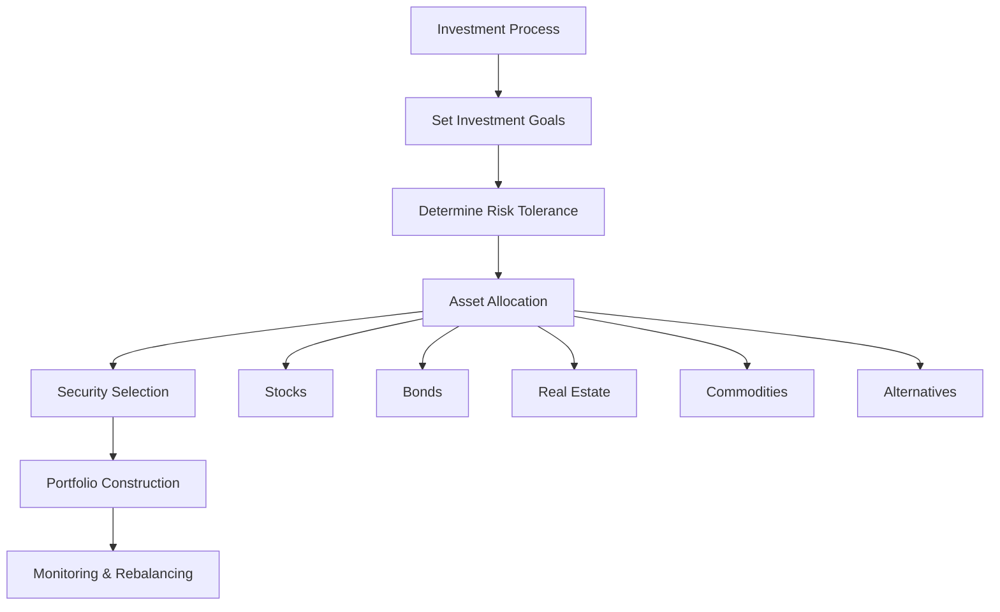

```mermaid
flowchart TD
    A[Investment Process] --> B[Set Investment Goals]
    B --> C[Determine Risk Tolerance]
    C --> D[Asset Allocation]
    D --> E[Security Selection]
    E --> F[Portfolio Construction]
    F --> G[Monitoring & Rebalancing]

    D --> H[Stocks]
    D --> I[Bonds]
    D --> J[Real Estate]
    D --> K[Commodities]
    D --> L[Alternatives]
```
