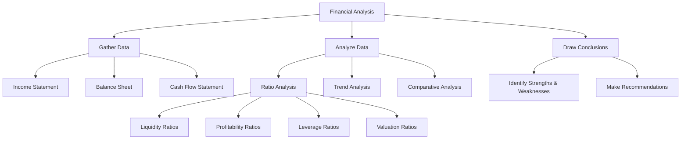

```mermaid
flowchart TD
    A[Financial Analysis] --> B[Gather Data]
    B --> C[Income Statement]
    B --> D[Balance Sheet]
    B --> E[Cash Flow Statement]

    A --> F[Analyze Data]
    F --> G[Ratio Analysis]
    G --> H[Liquidity Ratios]
    G --> I[Profitability Ratios]
    G --> J[Leverage Ratios]
    G --> K[Valuation Ratios]

    F --> L[Trend Analysis]
    F --> M[Comparative Analysis]

    A --> N[Draw Conclusions]
    N --> O[Identify Strengths & Weaknesses]
    N --> P[Make Recommendations]
```
