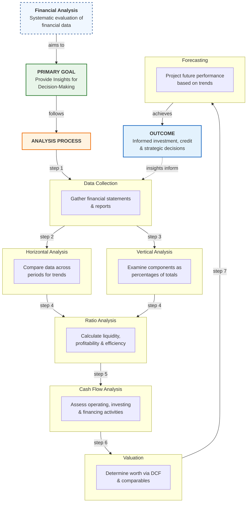

```mermaid
flowchart TD
    A[<b>Financial Analysis</b><br>Systematic evaluation of<br>financial data]:::title
    B[<b>PRIMARY GOAL</b><br>Provide Insights for<br>Decision-Making]:::goal
    C[<b>ANALYSIS PROCESS</b>]:::process
    
    subgraph D[Data Collection]
        D1[Gather financial statements<br>& reports]
    end
    
    subgraph E[Horizontal Analysis]
        E1[Compare data across<br>periods for trends]
    end
    
    subgraph F[Vertical Analysis]
        F1[Examine components as<br>percentages of totals]
    end
    
    subgraph G[Ratio Analysis]
        G1[Calculate liquidity,<br>profitability & efficiency]
    end
    
    subgraph H[Cash Flow Analysis]
        H1[Assess operating, investing<br>& financing activities]
    end
    
    subgraph I[Valuation]
        I1[Determine worth via DCF<br>& comparables]
    end
    
    subgraph J[Forecasting]
        J1[Project future performance<br>based on trends]
    end
    
    K[<b>OUTCOME</b><br>Informed investment, credit<br>& strategic decisions]:::outcome
    
    A -->|aims to| B
    B -->|follows| C
    C -->|step 1| D
    D -->|step 2| E
    D -->|step 3| F
    E & F -->|step 4| G
    G -->|step 5| H
    H -->|step 6| I
    I -->|step 7| J
    J -->|achieves| K
    K -.->|insights inform| D
    
    classDef title fill:#f0f7ff,stroke:#4a6fa5,stroke-width:2px,color:#333,stroke-dasharray:5 5
    classDef goal fill:#e8f5e9,stroke:#2e7d32,stroke-width:2px,color:#333
    classDef process fill:#fff3e0,stroke:#ef6c00,stroke-width:2px,color:#333
    classDef outcome fill:#e3f2fd,stroke:#1565c0,stroke-width:2px,color:#333
```
