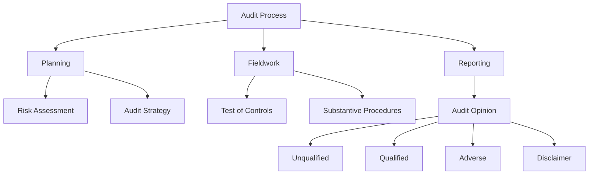

```mermaid
flowchart TD
    A[Audit Process] --> B[Planning]
    B --> C[Risk Assessment]
    B --> D[Audit Strategy]

    A --> E[Fieldwork]
    E --> F[Test of Controls]
    E --> G[Substantive Procedures]

    A --> H[Reporting]
    H --> I[Audit Opinion]
    I --> J[Unqualified]
    I --> K[Qualified]
    I --> L[Adverse]
    I --> M[Disclaimer]
```
