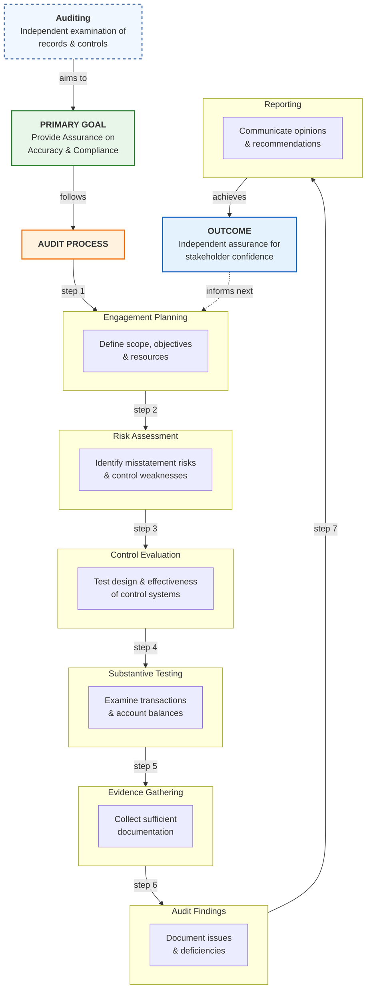

```mermaid
flowchart TD
    A[<b>Auditing</b><br>Independent examination of<br>records & controls]:::title
    B[<b>PRIMARY GOAL</b><br>Provide Assurance on<br>Accuracy & Compliance]:::goal
    C[<b>AUDIT PROCESS</b>]:::process
    
    subgraph D[Engagement Planning]
        D1[Define scope, objectives<br>& resources]
    end
    
    subgraph E[Risk Assessment]
        E1[Identify misstatement risks<br>& control weaknesses]
    end
    
    subgraph F[Control Evaluation]
        F1[Test design & effectiveness<br>of control systems]
    end
    
    subgraph G[Substantive Testing]
        G1[Examine transactions<br>& account balances]
    end
    
    subgraph H[Evidence Gathering]
        H1[Collect sufficient<br>documentation]
    end
    
    subgraph I[Audit Findings]
        I1[Document issues<br>& deficiencies]
    end
    
    subgraph J[Reporting]
        J1[Communicate opinions<br>& recommendations]
    end
    
    K[<b>OUTCOME</b><br>Independent assurance for<br>stakeholder confidence]:::outcome
    
    A -->|aims to| B
    B -->|follows| C
    C -->|step 1| D
    D -->|step 2| E
    E -->|step 3| F
    F -->|step 4| G
    G -->|step 5| H
    H -->|step 6| I
    I -->|step 7| J
    J -->|achieves| K
    K -.->|informs next| D
    
    classDef title fill:#f0f7ff,stroke:#4a6fa5,stroke-width:2px,color:#333,stroke-dasharray:5 5
    classDef goal fill:#e8f5e9,stroke:#2e7d32,stroke-width:2px,color:#333
    classDef process fill:#fff3e0,stroke:#ef6c00,stroke-width:2px,color:#333
    classDef outcome fill:#e3f2fd,stroke:#1565c0,stroke-width:2px,color:#333
```
