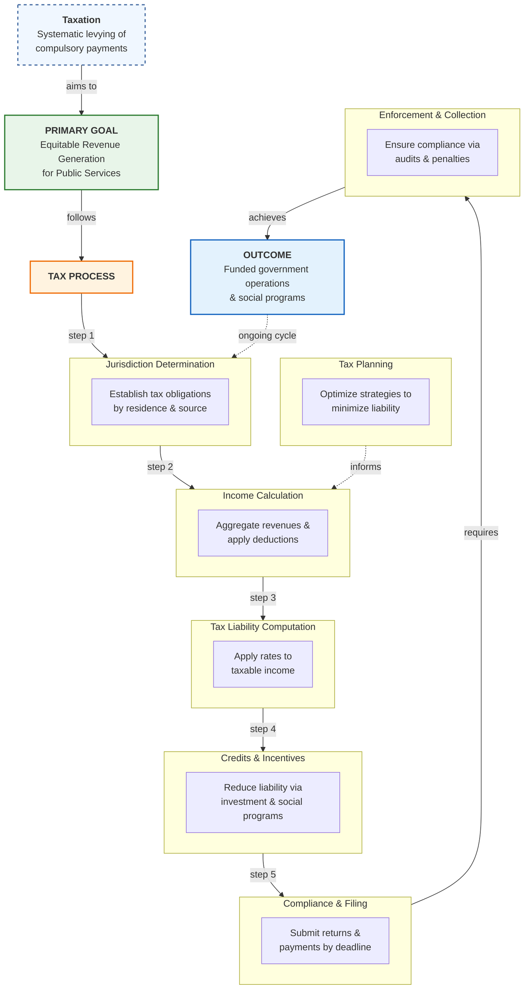

```mermaid
flowchart TD
    A[<b>Taxation</b><br>Systematic levying of<br>compulsory payments]:::title
    B[<b>PRIMARY GOAL</b><br>Equitable Revenue Generation<br>for Public Services]:::goal
    C[<b>TAX PROCESS</b>]:::process
    
    subgraph D[Jurisdiction Determination]
        D1[Establish tax obligations<br>by residence & source]
    end
    
    subgraph E[Income Calculation]
        E1[Aggregate revenues &<br>apply deductions]
    end
    
    subgraph F[Tax Liability Computation]
        F1[Apply rates to<br>taxable income]
    end
    
    subgraph G[Credits & Incentives]
        G1[Reduce liability via<br>investment & social programs]
    end
    
    subgraph H[Compliance & Filing]
        H1[Submit returns &<br>payments by deadline]
    end
    
    subgraph I[Tax Planning]
        I1[Optimize strategies to<br>minimize liability]
    end
    
    subgraph J[Enforcement & Collection]
        J1[Ensure compliance via<br>audits & penalties]
    end
    
    K[<b>OUTCOME</b><br>Funded government operations<br>& social programs]:::outcome
    
    A -->|aims to| B
    B -->|follows| C
    C -->|step 1| D
    D -->|step 2| E
    E -->|step 3| F
    F -->|step 4| G
    G -->|step 5| H
    I -.->|informs| E
    H -->|requires| J
    J -->|achieves| K
    K -.->|ongoing cycle| D
    
    classDef title fill:#f0f7ff,stroke:#4a6fa5,stroke-width:2px,color:#333,stroke-dasharray:5 5
    classDef goal fill:#e8f5e9,stroke:#2e7d32,stroke-width:2px,color:#333
    classDef process fill:#fff3e0,stroke:#ef6c00,stroke-width:2px,color:#333
    classDef outcome fill:#e3f2fd,stroke:#1565c0,stroke-width:2px,color:#333
```