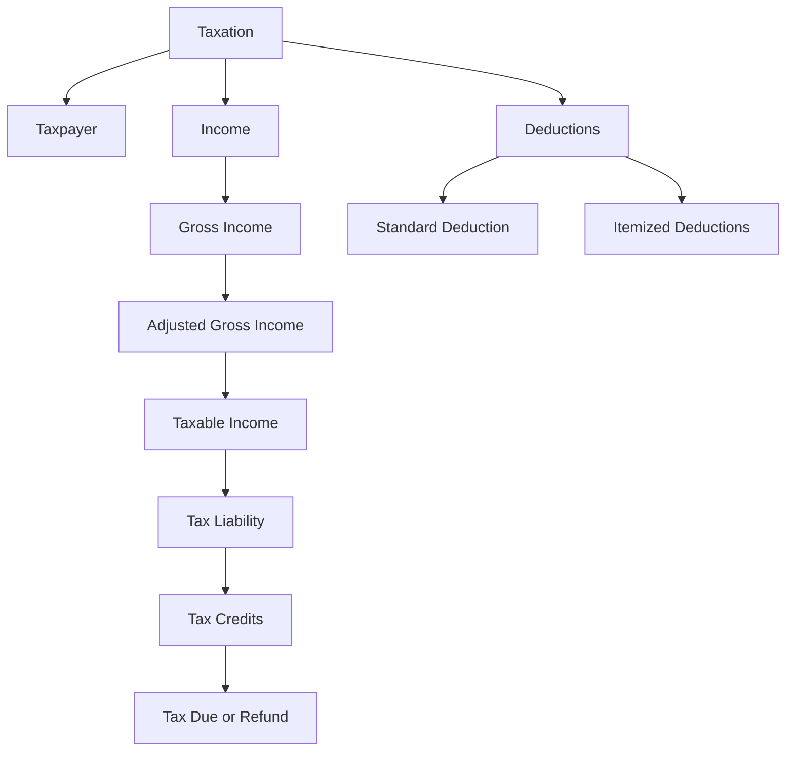

```mermaid
flowchart TD
    Taxation[Taxation] --> Taxpayer[Taxpayer]
    Taxation --> Income[Income]
    Taxation --> Deductions[Deductions]
    Income --> GrossIncome[Gross Income]
    GrossIncome --> AGI[Adjusted Gross Income]
    AGI --> TaxableIncome[Taxable Income]
    TaxableIncome --> TaxLiability[Tax Liability]
    TaxLiability --> Credits[Tax Credits]
    Credits --> TaxDue[Tax Due or Refund]
    Deductions --> Standard[Standard Deduction]
    Deductions --> Itemized[Itemized Deductions]
```