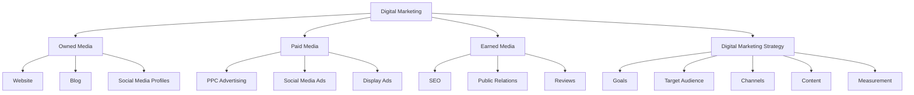

```mermaid
flowchart TD
    A[Digital Marketing] --> B[Owned Media]
    B --> C[Website]
    B --> D[Blog]
    B --> E[Social Media Profiles]

    A --> F[Paid Media]
    F --> G[PPC Advertising]
    F --> H[Social Media Ads]
    F --> I[Display Ads]

    A --> J[Earned Media]
    J --> K[SEO]
    J --> L[Public Relations]
    J --> M[Reviews]

    A --> N[Digital Marketing Strategy]
    N --> O[Goals]
    N --> P[Target Audience]
    N --> Q[Channels]
    N --> R[Content]
    N --> S[Measurement]
```
