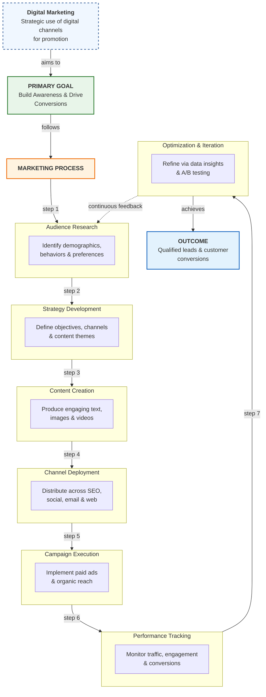

```mermaid
flowchart TD
    A[<b>Digital Marketing</b><br>Strategic use of digital channels<br>for promotion]:::title
    B[<b>PRIMARY GOAL</b><br>Build Awareness & Drive<br>Conversions]:::goal
    C[<b>MARKETING PROCESS</b>]:::process
    
    subgraph D[Audience Research]
        D1[Identify demographics,<br>behaviors & preferences]
    end
    
    subgraph E[Strategy Development]
        E1[Define objectives, channels<br>& content themes]
    end
    
    subgraph F[Content Creation]
        F1[Produce engaging text,<br>images & videos]
    end
    
    subgraph G[Channel Deployment]
        G1[Distribute across SEO,<br>social, email & web]
    end
    
    subgraph H[Campaign Execution]
        H1[Implement paid ads<br>& organic reach]
    end
    
    subgraph I[Performance Tracking]
        I1[Monitor traffic, engagement<br>& conversions]
    end
    
    subgraph J[Optimization & Iteration]
        J1[Refine via data insights<br>& A/B testing]
    end
    
    K[<b>OUTCOME</b><br>Qualified leads & customer<br>conversions]:::outcome
    
    A -->|aims to| B
    B -->|follows| C
    C -->|step 1| D
    D -->|step 2| E
    E -->|step 3| F
    F -->|step 4| G
    G -->|step 5| H
    H -->|step 6| I
    I -->|step 7| J
    J -->|achieves| K
    J -.->|continuous feedback| D
    
    classDef title fill:#f0f7ff,stroke:#4a6fa5,stroke-width:2px,color:#333,stroke-dasharray:5 5
    classDef goal fill:#e8f5e9,stroke:#2e7d32,stroke-width:2px,color:#333
    classDef process fill:#fff3e0,stroke:#ef6c00,stroke-width:2px,color:#333
    classDef outcome fill:#e3f2fd,stroke:#1565c0,stroke-width:2px,color:#333
```
