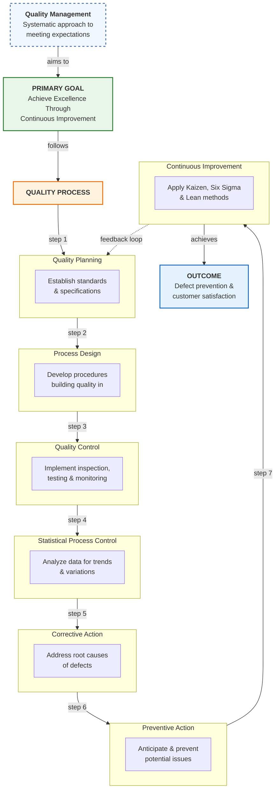

```mermaid
flowchart TD
    A[<b>Quality Management</b><br>Systematic approach to<br>meeting expectations]:::title
    B[<b>PRIMARY GOAL</b><br>Achieve Excellence Through<br>Continuous Improvement]:::goal
    C[<b>QUALITY PROCESS</b>]:::process
    
    subgraph D[Quality Planning]
        D1[Establish standards<br>& specifications]
    end
    
    subgraph E[Process Design]
        E1[Develop procedures<br>building quality in]
    end
    
    subgraph F[Quality Control]
        F1[Implement inspection,<br>testing & monitoring]
    end
    
    subgraph G[Statistical Process Control]
        G1[Analyze data for trends<br>& variations]
    end
    
    subgraph H[Corrective Action]
        H1[Address root causes<br>of defects]
    end
    
    subgraph I[Preventive Action]
        I1[Anticipate & prevent<br>potential issues]
    end
    
    subgraph J[Continuous Improvement]
        J1[Apply Kaizen, Six Sigma<br>& Lean methods]
    end
    
    K[<b>OUTCOME</b><br>Defect prevention &<br>customer satisfaction]:::outcome
    
    A -->|aims to| B
    B -->|follows| C
    C -->|step 1| D
    D -->|step 2| E
    E -->|step 3| F
    F -->|step 4| G
    G -->|step 5| H
    H -->|step 6| I
    I -->|step 7| J
    J -->|achieves| K
    J -.->|feedback loop| D
    
    classDef title fill:#f0f7ff,stroke:#4a6fa5,stroke-width:2px,color:#333,stroke-dasharray:5 5
    classDef goal fill:#e8f5e9,stroke:#2e7d32,stroke-width:2px,color:#333
    classDef process fill:#fff3e0,stroke:#ef6c00,stroke-width:2px,color:#333
    classDef outcome fill:#e3f2fd,stroke:#1565c0,stroke-width:2px,color:#333
```
