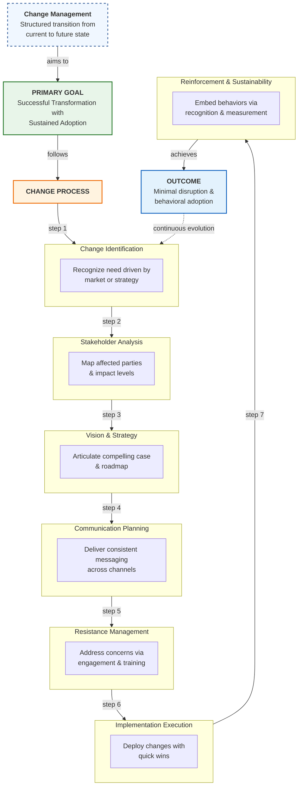

```mermaid
flowchart TD
    A[<b>Change Management</b><br>Structured transition from<br>current to future state]:::title
    B[<b>PRIMARY GOAL</b><br>Successful Transformation with<br>Sustained Adoption]:::goal
    C[<b>CHANGE PROCESS</b>]:::process
    
    subgraph D[Change Identification]
        D1[Recognize need driven by<br>market or strategy]
    end
    
    subgraph E[Stakeholder Analysis]
        E1[Map affected parties<br>& impact levels]
    end
    
    subgraph F[Vision & Strategy]
        F1[Articulate compelling case<br>& roadmap]
    end
    
    subgraph G[Communication Planning]
        G1[Deliver consistent messaging<br>across channels]
    end
    
    subgraph H[Resistance Management]
        H1[Address concerns via<br>engagement & training]
    end
    
    subgraph I[Implementation Execution]
        I1[Deploy changes with<br>quick wins]
    end
    
    subgraph J[Reinforcement & Sustainability]
        J1[Embed behaviors via<br>recognition & measurement]
    end
    
    K[<b>OUTCOME</b><br>Minimal disruption &<br>behavioral adoption]:::outcome
    
    A -->|aims to| B
    B -->|follows| C
    C -->|step 1| D
    D -->|step 2| E
    E -->|step 3| F
    F -->|step 4| G
    G -->|step 5| H
    H -->|step 6| I
    I -->|step 7| J
    J -->|achieves| K
    K -.->|continuous evolution| D
    
    classDef title fill:#f0f7ff,stroke:#4a6fa5,stroke-width:2px,color:#333,stroke-dasharray:5 5
    classDef goal fill:#e8f5e9,stroke:#2e7d32,stroke-width:2px,color:#333
    classDef process fill:#fff3e0,stroke:#ef6c00,stroke-width:2px,color:#333
    classDef outcome fill:#e3f2fd,stroke:#1565c0,stroke-width:2px,color:#333
```