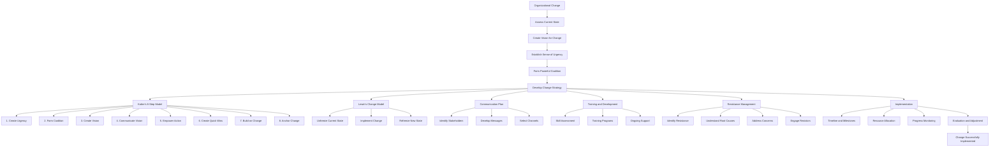

```mermaid
flowchart TD
    Change[Organizational Change] --> Assessment[Assess Current State]
    Assessment --> Vision[Create Vision for Change]
    Vision --> Urgency[Establish Sense of Urgency]
    Urgency --> Coalition[Form Powerful Coalition]
    Coalition --> Strategy[Develop Change Strategy]
    Strategy --> Kotter[Kotter's 8-Step Model]
    Strategy --> Lewin[Lewin's Change Model]
    Kotter --> Step1[1. Create Urgency]
    Kotter --> Step2[2. Form Coalition]
    Kotter --> Step3[3. Create Vision]
    Kotter --> Step4[4. Communicate Vision]
    Kotter --> Step5[5. Empower Action]
    Kotter --> Step6[6. Create Quick Wins]
    Kotter --> Step7[7. Build on Change]
    Kotter --> Step8[8. Anchor Change]
    Lewin --> Unfreeze[Unfreeze Current State]
    Lewin --> ChangePhase[Implement Change]
    Lewin --> Refreeze[Refreeze New State]
    Strategy --> Communication[Communication Plan]
    Communication --> Stakeholders[Identify Stakeholders]
    Communication --> Messages[Develop Messages]
    Communication --> Channels[Select Channels]
    Strategy --> Training[Training and Development]
    Training --> Skills[Skill Assessment]
    Training --> Programs[Training Programs]
    Training --> Support[Ongoing Support]
    Strategy --> Resistance[Resistance Management]
    Resistance --> Identify[Identify Resistance]
    Resistance --> Understand[Understand Root Causes]
    Resistance --> Address[Address Concerns]
    Resistance --> Engage[Engage Resistors]
    Strategy --> Implementation[Implementation]
    Implementation --> Timeline[Timeline and Milestones]
    Implementation --> Resources[Resource Allocation]
    Implementation --> Monitoring[Progress Monitoring]
    Implementation --> Evaluation[Evaluation and Adjustment]
    Evaluation --> Success[Change Successfully Implemented]
```