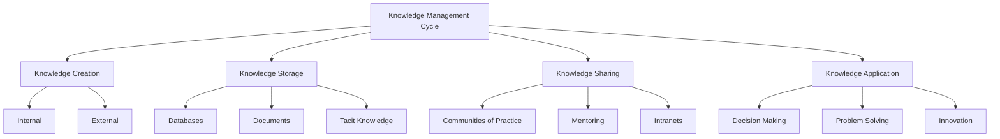

```mermaid
flowchart TD
    A[Knowledge Management Cycle] --> B[Knowledge Creation]
    B --> C[Internal]
    B --> D[External]

    A --> E[Knowledge Storage]
    E --> F[Databases]
    E --> G[Documents]
    E --> H[Tacit Knowledge]

    A --> I[Knowledge Sharing]
    I --> J[Communities of Practice]
    I --> K[Mentoring]
    I --> L[Intranets]

    A --> M[Knowledge Application]
    M --> N[Decision Making]
    M --> O[Problem Solving]
    M --> P[Innovation]
```
