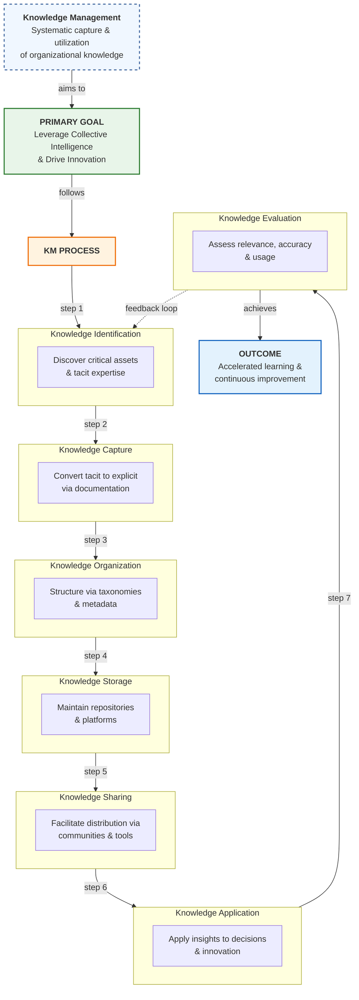

```mermaid
flowchart TD
    A[<b>Knowledge Management</b><br>Systematic capture & utilization<br>of organizational knowledge]:::title
    B[<b>PRIMARY GOAL</b><br>Leverage Collective Intelligence<br>& Drive Innovation]:::goal
    C[<b>KM PROCESS</b>]:::process
    
    subgraph D[Knowledge Identification]
        D1[Discover critical assets<br>& tacit expertise]
    end
    
    subgraph E[Knowledge Capture]
        E1[Convert tacit to explicit<br>via documentation]
    end
    
    subgraph F[Knowledge Organization]
        F1[Structure via taxonomies<br>& metadata]
    end
    
    subgraph G[Knowledge Storage]
        G1[Maintain repositories<br>& platforms]
    end
    
    subgraph H[Knowledge Sharing]
        H1[Facilitate distribution via<br>communities & tools]
    end
    
    subgraph I[Knowledge Application]
        I1[Apply insights to decisions<br>& innovation]
    end
    
    subgraph J[Knowledge Evaluation]
        J1[Assess relevance, accuracy<br>& usage]
    end
    
    K[<b>OUTCOME</b><br>Accelerated learning &<br>continuous improvement]:::outcome
    
    A -->|aims to| B
    B -->|follows| C
    C -->|step 1| D
    D -->|step 2| E
    E -->|step 3| F
    F -->|step 4| G
    G -->|step 5| H
    H -->|step 6| I
    I -->|step 7| J
    J -->|achieves| K
    J -.->|feedback loop| D
    
    classDef title fill:#f0f7ff,stroke:#4a6fa5,stroke-width:2px,color:#333,stroke-dasharray:5 5
    classDef goal fill:#e8f5e9,stroke:#2e7d32,stroke-width:2px,color:#333
    classDef process fill:#fff3e0,stroke:#ef6c00,stroke-width:2px,color:#333
    classDef outcome fill:#e3f2fd,stroke:#1565c0,stroke-width:2px,color:#333
```
