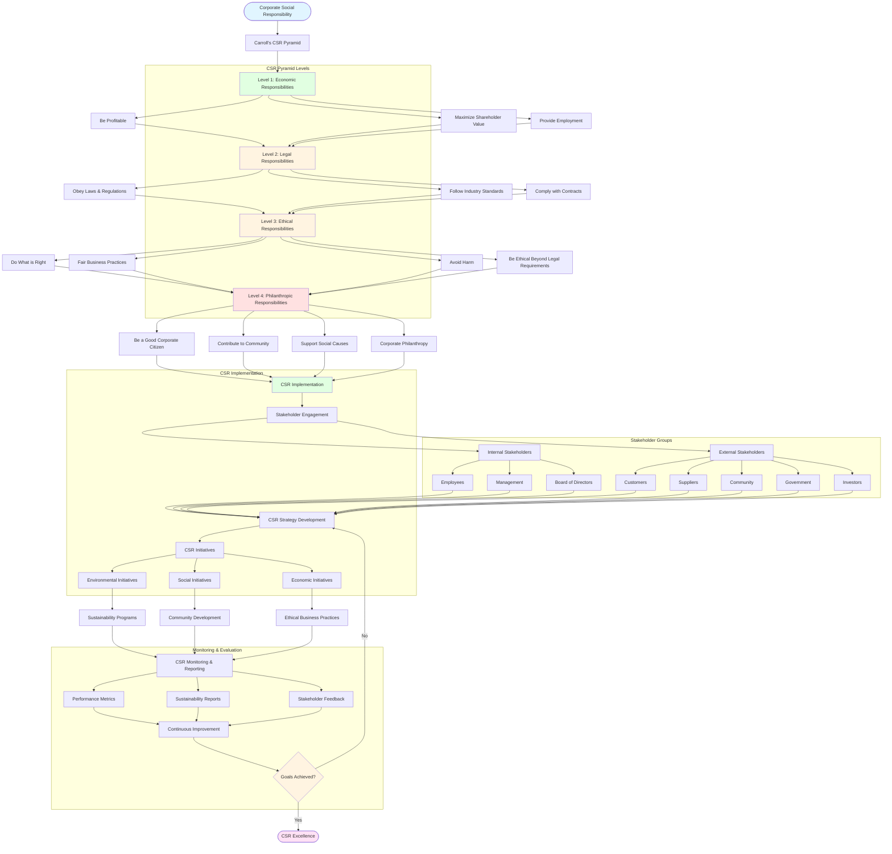

```mermaid
flowchart TD
    Start([Corporate Social Responsibility]) --> A[Carroll's CSR Pyramid]
    A --> B[Level 1: Economic Responsibilities]
    B --> C[Be Profitable]
    B --> D[Maximize Shareholder Value]
    B --> E[Provide Employment]
    C --> F[Level 2: Legal Responsibilities]
    D --> F
    E --> F
    F --> G[Obey Laws & Regulations]
    F --> H[Follow Industry Standards]
    F --> I[Comply with Contracts]
    G --> J[Level 3: Ethical Responsibilities]
    H --> J
    I --> J
    J --> K[Do What is Right]
    J --> L[Fair Business Practices]
    J --> M[Avoid Harm]
    J --> N[Be Ethical Beyond Legal Requirements]
    K --> O[Level 4: Philanthropic Responsibilities]
    L --> O
    M --> O
    N --> O
    O --> P[Be a Good Corporate Citizen]
    O --> Q[Contribute to Community]
    O --> R[Support Social Causes]
    O --> S[Corporate Philanthropy]
    P --> T[CSR Implementation]
    Q --> T
    R --> T
    S --> T
    T --> U[Stakeholder Engagement]
    U --> V[Internal Stakeholders]
    U --> W[External Stakeholders]
    V --> X[Employees]
    V --> Y[Management]
    V --> Z[Board of Directors]
    W --> AA[Customers]
    W --> AB[Suppliers]
    W --> AC[Community]
    W --> AD[Government]
    W --> AE[Investors]
    X --> AF[CSR Strategy Development]
    Y --> AF
    Z --> AF
    AA --> AF
    AB --> AF
    AC --> AF
    AD --> AF
    AE --> AF
    AF --> AG[CSR Initiatives]
    AG --> AH[Environmental Initiatives]
    AG --> AI[Social Initiatives]
    AG --> AJ[Economic Initiatives]
    AH --> AK[Sustainability Programs]
    AI --> AL[Community Development]
    AJ --> AM[Ethical Business Practices]
    AK --> AN[CSR Monitoring & Reporting]
    AL --> AN
    AM --> AN
    AN --> AO[Performance Metrics]
    AN --> AP[Sustainability Reports]
    AN --> AQ[Stakeholder Feedback]
    AO --> AR[Continuous Improvement]
    AP --> AR
    AQ --> AR
    AR --> AS{Goals Achieved?}
    AS -->|No| AF
    AS -->|Yes| End([CSR Excellence])
    
    subgraph Pyramid_Levels["CSR Pyramid Levels"]
        B
        F
        J
        O
    end
    
    subgraph Stakeholders["Stakeholder Groups"]
        V
        W
        X
        Y
        Z
        AA
        AB
        AC
        AD
        AE
    end
    
    subgraph Implementation["CSR Implementation"]
        T
        U
        AF
        AG
        AH
        AI
        AJ
    end
    
    subgraph Monitoring["Monitoring & Evaluation"]
        AN
        AO
        AP
        AQ
        AR
        AS
    end
    
    style Start fill:#e1f5ff
    style End fill:#ffe1f5
    style B fill:#e1ffe1
    style F fill:#fff4e1
    style J fill:#fff4e1
    style O fill:#ffe1e1
    style AS fill:#fff4e1
    style T fill:#e1ffe1
```
