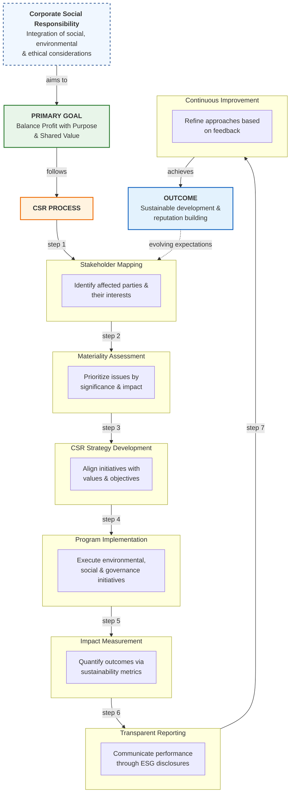

```mermaid
flowchart TD
    A[<b>Corporate Social Responsibility</b><br>Integration of social, environmental<br>& ethical considerations]:::title
    B[<b>PRIMARY GOAL</b><br>Balance Profit with Purpose<br>& Shared Value]:::goal
    C[<b>CSR PROCESS</b>]:::process
    
    subgraph D[Stakeholder Mapping]
        D1[Identify affected parties &<br>their interests]
    end
    
    subgraph E[Materiality Assessment]
        E1[Prioritize issues by<br>significance & impact]
    end
    
    subgraph F[CSR Strategy Development]
        F1[Align initiatives with<br>values & objectives]
    end
    
    subgraph G[Program Implementation]
        G1[Execute environmental,<br>social & governance initiatives]
    end
    
    subgraph H[Impact Measurement]
        H1[Quantify outcomes via<br>sustainability metrics]
    end
    
    subgraph I[Transparent Reporting]
        I1[Communicate performance<br>through ESG disclosures]
    end
    
    subgraph J[Continuous Improvement]
        J1[Refine approaches based<br>on feedback]
    end
    
    K[<b>OUTCOME</b><br>Sustainable development &<br>reputation building]:::outcome
    
    A -->|aims to| B
    B -->|follows| C
    C -->|step 1| D
    D -->|step 2| E
    E -->|step 3| F
    F -->|step 4| G
    G -->|step 5| H
    H -->|step 6| I
    I -->|step 7| J
    J -->|achieves| K
    K -.->|evolving expectations| D
    
    classDef title fill:#f0f7ff,stroke:#4a6fa5,stroke-width:2px,color:#333,stroke-dasharray:5 5
    classDef goal fill:#e8f5e9,stroke:#2e7d32,stroke-width:2px,color:#333
    classDef process fill:#fff3e0,stroke:#ef6c00,stroke-width:2px,color:#333
    classDef outcome fill:#e3f2fd,stroke:#1565c0,stroke-width:2px,color:#333
```
