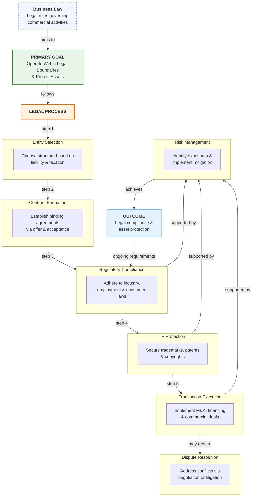

```mermaid
flowchart TD
    A[<b>Business Law</b><br>Legal rules governing<br>commercial activities]:::title
    B[<b>PRIMARY GOAL</b><br>Operate Within Legal Boundaries<br>& Protect Assets]:::goal
    C[<b>LEGAL PROCESS</b>]:::process
    
    subgraph D[Entity Selection]
        D1[Choose structure based on<br>liability & taxation]
    end
    
    subgraph E[Contract Formation]
        E1[Establish binding agreements<br>via offer & acceptance]
    end
    
    subgraph F[Regulatory Compliance]
        F1[Adhere to industry,<br>employment & consumer laws]
    end
    
    subgraph G[IP Protection]
        G1[Secure trademarks, patents<br>& copyrights]
    end
    
    subgraph H[Transaction Execution]
        H1[Implement M&A, financing<br>& commercial deals]
    end
    
    subgraph I[Dispute Resolution]
        I1[Address conflicts via<br>negotiation or litigation]
    end
    
    subgraph J[Risk Management]
        J1[Identify exposures &<br>implement mitigation]
    end
    
    K[<b>OUTCOME</b><br>Legal compliance &<br>asset protection]:::outcome
    
    A -->|aims to| B
    B -->|follows| C
    C -->|step 1| D
    D -->|step 2| E
    E -->|step 3| F
    F -->|step 4| G
    G -->|step 5| H
    H -->|may require| I
    F & G & H -->|supported by| J
    J -->|achieves| K
    K -.->|ongoing requirements| F
    
    classDef title fill:#f0f7ff,stroke:#4a6fa5,stroke-width:2px,color:#333,stroke-dasharray:5 5
    classDef goal fill:#e8f5e9,stroke:#2e7d32,stroke-width:2px,color:#333
    classDef process fill:#fff3e0,stroke:#ef6c00,stroke-width:2px,color:#333
    classDef outcome fill:#e3f2fd,stroke:#1565c0,stroke-width:2px,color:#333
```
