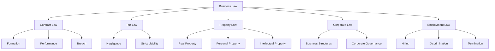

```mermaid
flowchart TD
    A[Business Law] --> B[Contract Law]
    B --> C[Formation]
    B --> D[Performance]
    B --> E[Breach]

    A --> F[Tort Law]
    F --> G[Negligence]
    F --> H[Strict Liability]

    A --> I[Property Law]
    I --> J[Real Property]
    I --> K[Personal Property]
    I --> L[Intellectual Property]

    A --> M[Corporate Law]
    M --> N[Business Structures]
    M --> O[Corporate Governance]

    A --> P[Employment Law]
    P --> Q[Hiring]
    P --> R[Discrimination]
    P --> S[Termination]
```
