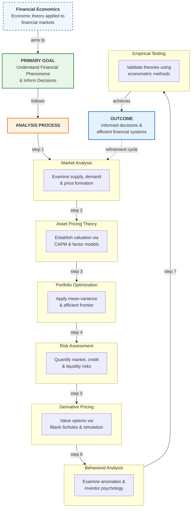

```mermaid
flowchart TD
    A[<b>Financial Economics</b><br>Economic theory applied to<br>financial markets]:::title
    B[<b>PRIMARY GOAL</b><br>Understand Financial Phenomena<br>& Inform Decisions]:::goal
    C[<b>ANALYSIS PROCESS</b>]:::process
    
    subgraph D[Market Analysis]
        D1[Examine supply, demand<br>& price formation]
    end
    
    subgraph E[Asset Pricing Theory]
        E1[Establish valuation via<br>CAPM & factor models]
    end
    
    subgraph F[Portfolio Optimization]
        F1[Apply mean-variance<br>& efficient frontier]
    end
    
    subgraph G[Risk Assessment]
        G1[Quantify market, credit<br>& liquidity risks]
    end
    
    subgraph H[Derivative Pricing]
        H1[Value options via<br>Black-Scholes & simulation]
    end
    
    subgraph I[Behavioral Analysis]
        I1[Examine anomalies &<br>investor psychology]
    end
    
    subgraph J[Empirical Testing]
        J1[Validate theories using<br>econometric methods]
    end
    
    K[<b>OUTCOME</b><br>Informed decisions &<br>efficient financial systems]:::outcome
    
    A -->|aims to| B
    B -->|follows| C
    C -->|step 1| D
    D -->|step 2| E
    E -->|step 3| F
    F -->|step 4| G
    G -->|step 5| H
    H -->|step 6| I
    I -->|step 7| J
    J -->|achieves| K
    K -.->|refinement cycle| D
    
    classDef title fill:#f0f7ff,stroke:#4a6fa5,stroke-width:2px,color:#333,stroke-dasharray:5 5
    classDef goal fill:#e8f5e9,stroke:#2e7d32,stroke-width:2px,color:#333
    classDef process fill:#fff3e0,stroke:#ef6c00,stroke-width:2px,color:#333
    classDef outcome fill:#e3f2fd,stroke:#1565c0,stroke-width:2px,color:#333
```
